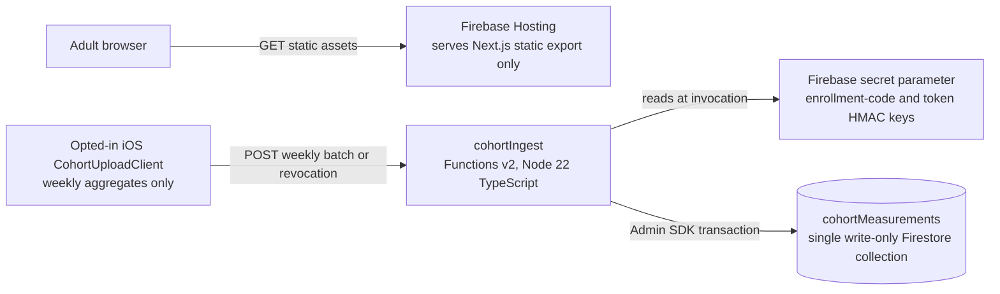
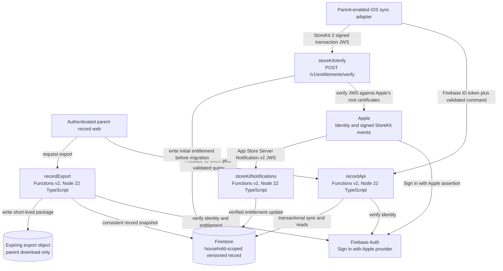

# Backend architecture

This document implements ADR-000 D6-D8 and D10. The MVP backend is deliberately tiny: Firebase
Hosting for five static pages and exactly one callable surface, the consented cohort ingest
Function. It has no learner backend. The parent-record services below are post-MVP and must not be
deployed as part of the retention MVP.

## MVP deployment



The deployed Functions barrel exports `cohortIngest` and nothing else. Static Hosting does not
rewrite a page request to a Function. There is no Firebase Auth tenant, learner collection,
email capture, payment webhook, scheduled messaging, analytics ingestion, or content API in the
MVP. Secrets are Firebase secret parameters supplied by deployment configuration and are never
hardcoded in TypeScript, JSON, the iOS bundle, or documentation.

## `cohortIngest` HTTP contract

The single Function exposes two narrowly scoped routes. A per-family enrollment code is
single-use and is exchanged once for a device-generated participant token. The shared cohort
code is removed; it is never accepted by either route.

### Enrollment exchange

`POST /v1/cohort/enroll`

Required headers:

```http
Authorization: Enrollment <per-family-single-use-enrollment-code>
Content-Type: application/json
```

Request:

```json
{
  "schemaVersion": 1,
  "operation": "enroll",
  "participantToken": "base64url-encoded-32-random-bytes"
}
```

The client generates the participant token with a cryptographically secure system random
generator. The Function atomically validates and consumes the family-specific enrollment code,
registers only the HMAC of that token, and returns no code or token:

```json
{
  "schemaVersion": 1,
  "enrolled": true,
  "requestId": "018f2500-e9a4-77f0-b17a-36f73f8aca76"
}
```

Replaying an enrollment code is rejected and cannot create a second participant token. The code
is not stored with a household, learner, name, or account identifier.

### Batch and revocation requests

`POST /v1/cohort/batches`

Required headers:

```http
Authorization: Cohort <enrolled-participant-token>
Content-Type: application/json
Idempotency-Key: <UUID matching body.batchId, for weeklyBatch>
```

Only HTTPS `POST` is allowed. The native client does not need CORS; browser origins receive no
CORS allow header. The maximum request body is 4 KiB. The edge rate limiter sees the source
address, applies failed-authentication backoff, then strips the client address before forwarding
the request to the Function. The Function never receives or logs the client address. It validates
the raw body with a strict Zod discriminated union before any Firestore access.

A weekly batch request is:

```json
{
  "schemaVersion": 1,
  "operation": "weeklyBatch",
  "batchId": "018f24f7-b0ae-7bb1-9d7e-b39f7d5a3d51",
  "periodStart": "2026-09-07",
  "periodEnd": "2026-09-13",
  "counters": {
    "sessionsStarted": 3,
    "skillsReached": 4,
    "daysSinceFirstOpenBucket": "14-27"
  }
}
```

A revocation request, sent through the same Function and route, is:

```json
{
  "schemaVersion": 1,
  "operation": "revoke",
  "requestedAt": "2026-09-07T18:30:00Z"
}
```

Validation requires UUIDv7/UUIDv4 syntax for `batchId`, ISO dates, a period of one through eight
days, nonnegative integer counters, `sessionsStarted <= 100`, `skillsReached <= 500`, and one of
the wide `daysSinceFirstOpenBucket` values `0-6`, `7-13`, `14-27`, `28-55`, `56-111`, or `112+`.
Unknown fields are rejected. The exact first-open day is never sent.

The client schedules each otherwise-weekly upload at the weekly eligibility boundary plus a
cryptographically generated random jitter uniformly distributed across at least `-24` to `+24`
hours. The server returns the next eligible window, not a fixed seven-day timestamp, and retries
remain within that jittered window. Upload cadence must not become a participant signature.

The enrollment route normalizes and HMACs the single-use enrollment code with a server secret,
then constant-time compares it with the unconsumed code-hash allowlist stored in a Firebase secret
parameter. Batch and revocation routes HMAC the enrolled participant token with a different
secret before constructing document IDs. Raw codes, tokens, authorization headers, request
bodies, and client addresses are not copied to application logs or Firestore.

### Success response

An accepted or already-accepted weekly batch returns `202 Accepted`:

```json
{
  "schemaVersion": 1,
  "accepted": true,
  "duplicate": false,
  "requestId": "018f2500-e9a4-77f0-b17a-36f73f8aca76",
  "nextUploadAfter": "2026-09-14T00:00:00Z"
}
```

An idempotent replay sets `duplicate: true` and returns the original next-upload boundary without
incrementing counters or quota. Accepted revocation returns `202` with `accepted`, `requestId`,
and `revoked: true`; repeating it is also successful.

### Rate limit and errors

For failed enrollment or participant authentication, the edge limiter keys attempts by source
address and applies exponential backoff: 60 seconds, 120 seconds, 240 seconds, doubling to a
one-hour cap. The edge returns `429` during backoff and strips the address before the Function
sees the request. This closes the failed-code-guessing path without retaining the address in the
application data boundary.

For `weeklyBatch`, enforce six requests per participant-token hash per rolling hour and 120
accepted requests per participant-token hash per UTC day. There is no quota keyed to an
enrollment code or shared cohort identifier, so one family cannot exhaust another family's or the
study's quota. Only one batch ID and one accepted batch per participant/week are stored. Quota
documents live in the same `cohortMeasurements` collection so D6's one-collection boundary is
preserved. A revocation with a valid participant token bypasses an exhausted write quota so a
parent is never prevented from stopping participation.

Every non-2xx response uses this envelope and includes no submitted value:

```json
{
  "schemaVersion": 1,
  "error": {
    "code": "rate_limited",
    "message": "Try again after the supplied delay.",
    "requestId": "018f2500-e9a4-77f0-b17a-36f73f8aca76",
    "retryable": true,
    "retryAfterSeconds": 1800
  }
}
```

| Status | Stable code | Meaning/client behavior |
| --- | --- | --- |
| 400 | `invalid_request` | Shape, range, date, or idempotency header failed; do not retry unchanged |
| 401 | `enrollment_code_invalid` | Enrollment code is invalid, expired, or unknown; do not retry automatically |
| 401 | `participant_token_invalid` | Token was never enrolled, was revoked, or is malformed; stop automatic upload and surface parent action |
| 409 | `enrollment_code_used` | Single-use enrollment code was already exchanged; do not retry with that code |
| 409 | `period_conflict` | A different batch ID already owns this participant/week; retain locally for explicit resolution |
| 413 | `payload_too_large` | Body exceeds 4 KiB; do not retry unchanged |
| 429 | `auth_backoff` | Failed authentication threshold was reached at the edge; honor `Retry-After` and do not guess again |
| 429 | `rate_limited` | Participant quota was reached; honor `Retry-After` and keep the single local batch |
| 500 | `internal` | No commit is acknowledged; bounded exponential retry is allowed |
| 503 | `temporarily_unavailable` | Preserve local batch and retry after the supplied delay |

Responses set `Cache-Control: no-store`. Logs use generated `requestId`, operation, status,
latency bucket, and error code only. Metric values and authorization material are excluded.

## Firestore shape and rules

The one `cohortMeasurements` collection holds three server-authored document kinds, each stamped
with `_schemaVersion: 1`: idempotent `batch`, transactional `quota`, and `revocation`. A batch stores
the participant-token HMAC, code HMAC, period, three counters, received timestamp, and batch ID.
A quota stores only bucket keys and counts. A revocation tombstone blocks later batches and drives
deletion under the signed study retention policy. None is connected to a household or learner.

Client rules deny every operation. "Write-only" describes the product path: the Function writes
with Admin SDK authority, while iOS and web clients can neither write Firestore directly nor read
the collection.

```text
rules_version = '2';
service cloud.firestore {
  match /databases/{database}/documents {
    match /cohortMeasurements/{documentId} {
      allow read, write: if false;
    }
    match /{document=**} {
      allow read, write: if false;
    }
  }
}
```

The emulator suite proves anonymous, authenticated, and admin-claim client contexts all receive
permission denied. The Function integration test uses Admin SDK and separately proves that a
valid request commits exactly once.

## Post-MVP parent-record backend



All Functions use the repository's existing Node 22 TypeScript runtime, Firebase Functions v2,
structured logs without record payloads, Zod input validation, and Secret Manager parameters.
No client reads or writes Firestore directly; the deny-by-default rules remain closed and trusted
Functions use Admin SDK after application authorization.

### Service responsibilities

| Service | Contract and authorization |
| --- | --- |
| `recordApi` | Verifies a Firebase ID token backed by Sign in with Apple, derives the household from the verified UID, checks consent and server entitlement for paid record operations, accepts the idempotent migration merge/status contract and later sync commands, and serves only that household. Instruction never calls it and never checks entitlement. |
| `storeKitVerify` | Accepts the StoreKit 2 signed transaction JWS from the parent-enabled client at `POST /v1/entitlements/verify`; verifies the JWS signature chain against Apple's trusted root certificates server-side, environment, bundle ID, product, transaction identity, and purchase state; then writes the initial server entitlement before migration begins. It trusts no client-supplied entitlement flag. |
| `storeKitNotifications` | Accepts App Store Server Notifications v2, verifies the signed JWS chain/environment/bundle/product, deduplicates notification and transaction IDs, and transactionally projects `active`, `gracePeriod`, `expired`, `revoked`, or `billingRetry` into `entitlements/current`. For later renewal, refund, revocation, expiration, or billing state changes, this webhook is authoritative and wins any conflict with the initial synchronous verification. |
| `recordExport` | Verifies parent identity, ownership, and current entitlement; reads a consistent learner snapshot; resolves skill labels against the stamped taxonomy version; creates a versioned JSON plus human-readable PDF package; and returns a short-lived, single-household download. |

Sign in with Apple private relay is the default address retained by Firebase Auth when Apple
provides it. The `Household` document stores the verified owner UID and consent facts, not an email
copied from a client claim. Multi-child records remain subcollections of that household.

### Post-MVP migration merge and recovery contract

`recordApi` does not promote a staging generation by replacing the active learner record. A
temporary staging area may validate bounded input, but commit is an idempotent set union of the
individual immutable `SESSION` and `ATTEMPT` records keyed by their UUID primary keys. An existing
UUID with the same immutable content is a no-op; a conflicting payload for an existing UUID is
quarantined and fails the batch. `MASTERY_STATE` is never transferred from the client: the server
recomputes it from the merged attempt/session event stream under the named policy version.

`POST /v1/migration/merge` accepts a household-scoped idempotency key, a manifest, and bounded
records. Replaying the same batch changes nothing. The response includes the active generation ID
and server manifest only after the union and derived-state recomputation commit.

`GET /v1/migration/status` is idempotent and returns the current active generation ID and server
manifest (counts, UUID checksums, schema/content/taxonomy versions, and derived mastery checksum).
The client calls it after a timeout or a lost acknowledgement; it does not infer failure and
retry into a replacement-generation rejection. No migration path may reduce the set of attempts
the server holds: for every migration, `serverAttemptsAfter` is a superset of
`serverAttemptsBefore`.

The synchronous entitlement verification above must complete before `recordApi` accepts the
migration merge. App Store notifications remain the authority for all later entitlement state
changes, including refund and revocation, even if a stale client verification response conflicts.

### Post-MVP account deletion and Apple token revocation

The parent-enabled app must expose an in-app, parent-gated **Delete account and data** action to
meet App Store Review Guideline **5.1.1(v)**. The flow reauthenticates the Sign in with Apple
account, shows the exact deletion scope, and calls an idempotent `POST /v1/account/deletion`.
The API disables access immediately, records a deletion job, deletes the household, learners,
sessions, attempts, mastery states, snapshots, export objects, and server entitlement, and
removes the local synced record and stored credentials after the parent confirms completion.

As part of the same job, the server revokes the Apple refresh/token credential through Apple's
token-revocation endpoint using the server-held client credentials, then deletes the Firebase Auth
account. `GET /v1/account/deletion/status` lets the app recover after a lost acknowledgement.
If a provider or statutory retention rule requires a minimal deletion audit, it contains no
learner content or re-usable identity token and is retained only under the approved policy.
Access remains disabled while revocation/deletion retries are pending; a successful response is
not reported until the job has durably completed its required steps.

### Sync and entitlement invariants

- The first local migration uses an idempotency key, UUID set-union merge, record counts, and
  checksums. A validated merge advances the active generation; rollback leaves local history
  untouched.
- Incremental writes are idempotent by stable local UUID and reject an unknown `_schemaVersion`.
- An entitlement unlocks parent record views, snapshots, and exports. It never filters curriculum,
  teaching engines, attempts, or local mastery.
- A client-supplied `householdId`, owner UID, mastery label, or entitlement state is never trusted.
- Record snapshots contain evidence-backed skill language and never represent diagnosis.

## Migrations

The repository already provides `scripts/migrate.mjs`, a Firestore migration runner with explicit
project selection, dry-run plans, bounded batches, checkpoint-after-write behavior, quarantine,
idempotent `_schemaVersion` stamps, and non-destructive expansion. Every post-MVP Firestore
migration uses that runner. A migration is planned and rehearsed against synthetic data, applied
as the expand/migrate step, verified by counts and checksums, and contracted only in a later
release. Do not add one-off Admin SDK migration scripts.

## Deployment gates

For the MVP, the deploy manifest must contain one Hosting site, one `cohortIngest` Function, one
Firestore ruleset, and no other Function export. For the record phase, deployments remain
environment-explicit and require emulator contract tests, Firestore rule tests, migration plan
output, entitlement replay tests, and a local-to-cloud rollback rehearsal. Neither phase is
authorized for production merely by this document.
