# Content pipeline

This document implements ADR-000 D2-D4. Curriculum is versioned repository data, not Swift
initializers. An educator can author and review it without compiling Swift or asking an engineer
to translate a scope-and-sequence row.

## Repository contract

The app bundle receives four validated artifacts from a content release:

| Artifact | Repository location | Purpose |
| --- | --- | --- |
| Level corpus | `content/levels/*.json` | One file per level using the schema below |
| Skill taxonomy | `content/skill-taxonomy.json` | Stable skill IDs, descriptions, prerequisites, and teaching order |
| Audio manifest | `content/audio-assets.json` | `AudioAsset` metadata and checksum for every recording |
| Recorded audio | `content/audio/*.m4a` | Single-voice 48 kHz mono AAC instruction, phoneme, grapheme, word, and encouragement assets |

Those are implementation target paths, not evidence that the files exist today. Xcode copies only
the validator's immutable release output, `content/build/<contentVersion>/`, into the app bundle.
The app refuses a corpus whose schema version is newer than its decoder and never fetches a
replacement over the network (D1).

## Level definition JSON Schema

Each level is a self-contained JSON document. The closed `engine` enum contains only
instructional engines that `ActivityFeature` can render. Placement and pacing select levels; they
are Domain engines but are not level renderers.

```json
{
  "$schema": "https://json-schema.org/draft/2020-12/schema",
  "$id": "https://iepandthrive.example/schemas/level-definition.schema.json",
  "title": "IEP & Thrive level definition",
  "type": "object",
  "additionalProperties": false,
  "required": [
    "schemaVersion",
    "contentVersion",
    "id",
    "revision",
    "sequenceIndex",
    "title",
    "engine",
    "skillIds",
    "audioAssetIds",
    "exampleWords",
    "activity"
  ],
  "properties": {
    "schemaVersion": { "type": "integer", "const": 1 },
    "contentVersion": { "type": "string", "pattern": "^[0-9]{4}\\.[0-9]{2}\\.[0-9]+$" },
    "id": { "type": "string", "pattern": "^level\\.[a-z0-9]+(?:[.-][a-z0-9]+)*$" },
    "revision": { "type": "integer", "minimum": 1 },
    "sequenceIndex": { "type": "integer", "minimum": 0 },
    "title": { "type": "string", "minLength": 1, "maxLength": 80 },
    "engine": {
      "type": "string",
      "enum": ["tracing", "blending", "wordBuilding"]
    },
    "skillIds": {
      "type": "array",
      "minItems": 1,
      "uniqueItems": true,
      "items": { "type": "string", "pattern": "^skill\\.[a-z0-9]+(?:[.-][a-z0-9]+)*$" }
    },
    "audioAssetIds": {
      "type": "object",
      "additionalProperties": false,
      "required": ["introduction", "model", "prompt", "success", "encouragement"],
      "properties": {
        "introduction": { "$ref": "#/$defs/audioId" },
        "model": { "$ref": "#/$defs/audioId" },
        "prompt": { "$ref": "#/$defs/audioId" },
        "success": { "$ref": "#/$defs/audioId" },
        "encouragement": {
          "type": "array",
          "minItems": 1,
          "uniqueItems": true,
          "items": { "$ref": "#/$defs/audioId" }
        }
      }
    },
    "exampleWords": {
      "type": "array",
      "minItems": 1,
      "items": { "$ref": "#/$defs/exampleWord" }
    },
    "activity": {
      "oneOf": [
        { "$ref": "#/$defs/tracingActivity" },
        { "$ref": "#/$defs/blendingActivity" },
        { "$ref": "#/$defs/wordBuildingActivity" }
      ]
    }
  },
  "allOf": [
    {
      "if": { "properties": { "engine": { "const": "tracing" } } },
      "then": { "properties": { "activity": { "$ref": "#/$defs/tracingActivity" } } }
    },
    {
      "if": { "properties": { "engine": { "const": "blending" } } },
      "then": { "properties": { "activity": { "$ref": "#/$defs/blendingActivity" } } }
    },
    {
      "if": { "properties": { "engine": { "const": "wordBuilding" } } },
      "then": { "properties": { "activity": { "$ref": "#/$defs/wordBuildingActivity" } } }
    }
  ],
  "$defs": {
    "audioId": {
      "type": "string",
      "pattern": "^audio\\.[a-z0-9]+(?:[.-][a-z0-9]+)*$"
    },
    "exampleWord": {
      "type": "object",
      "additionalProperties": false,
      "required": ["text", "phonemeIds", "audioAssetId"],
      "properties": {
        "text": { "type": "string", "minLength": 1, "maxLength": 40 },
        "phonemeIds": {
          "type": "array",
          "minItems": 1,
          "items": { "type": "string", "pattern": "^phoneme\\.[a-z0-9]+(?:[.-][a-z0-9]+)*$" }
        },
        "audioAssetId": { "$ref": "#/$defs/audioId" }
      }
    },
    "tracingActivity": {
      "type": "object",
      "additionalProperties": false,
      "required": ["kind", "glyphs"],
      "properties": {
        "kind": { "const": "tracing" },
        "glyphs": { "type": "string", "minLength": 1, "maxLength": 12 }
      }
    },
    "blendingActivity": {
      "type": "object",
      "additionalProperties": false,
      "required": ["kind", "word", "phonemeIds"],
      "properties": {
        "kind": { "const": "blending" },
        "word": { "type": "string", "minLength": 1, "maxLength": 40 },
        "phonemeIds": {
          "type": "array",
          "minItems": 2,
          "items": { "type": "string", "pattern": "^phoneme\\.[a-z0-9]+(?:[.-][a-z0-9]+)*$" }
        }
      }
    },
    "wordBuildingActivity": {
      "type": "object",
      "additionalProperties": false,
      "required": ["kind", "word", "phonemeIds", "graphemeTiles"],
      "properties": {
        "kind": { "const": "wordBuilding" },
        "word": { "type": "string", "minLength": 1, "maxLength": 40 },
        "phonemeIds": {
          "type": "array",
          "minItems": 1,
          "items": { "type": "string", "pattern": "^phoneme\\.[a-z0-9]+(?:[.-][a-z0-9]+)*$" }
        },
        "graphemeTiles": {
          "type": "array",
          "minItems": 1,
          "uniqueItems": true,
          "items": { "type": "string", "minLength": 1, "maxLength": 8 }
        }
      }
    }
  }
}
```

The validator also asserts that `activity.kind` equals `engine`, that the primary activity word
appears in `exampleWords`, and that the number of Elkonin boxes equals `phonemeIds.length`, not
the number of Unicode characters.

## Skill taxonomy JSON Schema

```json
{
  "$schema": "https://json-schema.org/draft/2020-12/schema",
  "$id": "https://iepandthrive.example/schemas/skill-taxonomy.schema.json",
  "title": "IEP & Thrive skill taxonomy",
  "type": "object",
  "additionalProperties": false,
  "required": ["schemaVersion", "taxonomyId", "taxonomyVersion", "skills"],
  "properties": {
    "schemaVersion": { "type": "integer", "const": 1 },
    "taxonomyId": { "type": "string", "const": "iep-thrive.decoding" },
    "taxonomyVersion": { "type": "string", "pattern": "^[0-9]{4}\\.[0-9]{2}\\.[0-9]+$" },
    "skills": {
      "type": "array",
      "minItems": 1,
      "items": { "$ref": "#/$defs/skill" }
    }
  },
  "$defs": {
    "audioId": {
      "type": "string",
      "pattern": "^audio\\.[a-z0-9]+(?:[.-][a-z0-9]+)*$"
    },
    "exampleWord": {
      "type": "object",
      "additionalProperties": false,
      "required": ["text", "phonemeIds", "audioAssetId"],
      "properties": {
        "text": { "type": "string", "minLength": 1, "maxLength": 40 },
        "phonemeIds": {
          "type": "array",
          "minItems": 1,
          "items": { "type": "string", "pattern": "^phoneme\\.[a-z0-9]+(?:[.-][a-z0-9]+)*$" }
        },
        "audioAssetId": { "$ref": "#/$defs/audioId" }
      }
    },
    "skill": {
      "type": "object",
      "additionalProperties": false,
      "required": [
        "schemaVersion",
        "id",
        "sequenceIndex",
        "kind",
        "label",
        "description",
        "prerequisiteSkillIds",
        "graphemes",
        "phonemeIds",
        "phonemeAudioAssetIds",
        "exampleWords"
      ],
      "properties": {
        "schemaVersion": { "type": "integer", "const": 1 },
        "id": { "type": "string", "pattern": "^skill\\.[a-z0-9]+(?:[.-][a-z0-9]+)*$" },
        "sequenceIndex": { "type": "integer", "minimum": 0 },
        "kind": {
          "type": "string",
          "enum": ["phonemeGrapheme", "blend", "digraph", "vowelTeam", "syllableType", "morphology"]
        },
        "label": { "type": "string", "minLength": 1, "maxLength": 100 },
        "description": { "type": "string", "minLength": 1, "maxLength": 400 },
        "prerequisiteSkillIds": {
          "type": "array",
          "uniqueItems": true,
          "items": { "type": "string", "pattern": "^skill\\.[a-z0-9]+(?:[.-][a-z0-9]+)*$" }
        },
        "graphemes": {
          "type": "array",
          "minItems": 1,
          "uniqueItems": true,
          "items": { "type": "string", "minLength": 1, "maxLength": 12 }
        },
        "phonemeIds": {
          "type": "array",
          "minItems": 1,
          "uniqueItems": true,
          "items": { "type": "string", "pattern": "^phoneme\\.[a-z0-9]+(?:[.-][a-z0-9]+)*$" }
        },
        "phonemeAudioAssetIds": {
          "type": "array",
          "minItems": 1,
          "uniqueItems": true,
          "items": { "$ref": "#/$defs/audioId" }
        },
        "exampleWords": {
          "type": "array",
          "minItems": 1,
          "items": { "$ref": "#/$defs/exampleWord" }
        }
      }
    }
  }
}
```

The taxonomy validator additionally requires unique skill IDs and sequence indexes, existing
prerequisite IDs, an acyclic prerequisite graph, and prerequisites whose sequence indexes precede
the dependent skill. A label change may increment the taxonomy version but must not mint a new
skill ID for the same concept.

## Educator authoring loop

```mermaid
flowchart LR
    Sequence["Educator scope-and-sequence sheet<br/>one row per intended encounter"]
    Form["Content authoring form<br/>closed engine and skill pickers"]
    Draft["Generated JSON draft<br/>no Swift editing"]
    Validate["Local validator<br/>schema, graph, audio, pronunciation"]
    Listen["Educator preview<br/>plays exact bundled recordings"]
    Review["Content review<br/>educator approves wording and sequence"]
    CI["CI content gate<br/>repeats validator from a clean checkout"]
    Bundle["Immutable content release<br/>copied into the iOS bundle"]

    Sequence -->|"imports authored rows"| Form
    Form -->|"exports deterministic files"| Draft
    Draft -->|"runs automatically"| Validate
    Validate -->|"valid corpus"| Listen
    Validate -->|"field-level error"| Form
    Listen -->|"needs correction"| Form
    Listen -->|"approved"| Review
    Review -->|"content-only change"| CI
    CI -->|"pass"| Bundle
    CI -->|"fail with file and JSON path"| Form
```



The authoring form reads the current taxonomy and audio manifest, so engine, skill, phoneme, and
audio fields are pickers rather than free text. Import assigns stable IDs once and produces a
deterministically sorted diff. The educator can hear every prompt, phoneme, and example word in
the same order as the activity before submitting. Review is of curriculum data and recordings,
not Swift source; an engineer is not in the normal loop.

Audio production records one voice in one room, trims leading/trailing silence to the published
limit, normalizes loudness, encodes 48 kHz mono AAC, and writes a checksum into the manifest.
Instructional playback resolves only an `AudioAssetID`. `AVSpeechSynthesizer` is not a fallback:
an absent or undecodable recording is a build failure under D2.

## Validator and CI gate

The validator takes explicit paths to the taxonomy, level directory, audio manifest, and audio
directory. It exits nonzero and emits stable diagnostics in
`file:json-pointer:error-code:message` form. It performs, in order:

1. JSON parsing and JSON Schema validation, including `additionalProperties: false`.
2. Global uniqueness and version-consistency checks across every file.
3. Closed-reference checks from levels to skills, phonemes, and audio assets.
4. Audio file existence, manifest checksum, decodability, sample-rate/channel, and nonzero-duration
   checks.
5. Taxonomy prerequisite cycle/order validation and curriculum reachability from the first level.
6. Coverage checks proving every skill is taught by at least one level and has at least one
   independent or mastery-check encounter available to pacing.
7. Engine-specific semantic checks, including phoneme/box counts and example-word membership.
8. A deterministic release-manifest build whose hash changes whenever validated content changes.

CI runs the validator before any iOS compile and again against the copied bundle resources. The
build and App Store release jobs depend on this gate; warnings are not accepted for missing or
unreachable instruction.

The gate must make these three shipped-class failures impossible:

| Forbidden failure | Required check |
| --- | --- |
| A level names an engine that does not exist | JSON Schema rejects anything outside `tracing`, `blending`, and `wordBuilding`; the validator also compares that enum with the registered `ActivityFeature` cases. Thus `predict`, `monitor`, `retell`, `main-idea`, `details`, and `topic` cannot become engines. This directly prevents the shipped behavior that would speak `main-idea` and trace the string. |
| A level references a missing audio asset | Every referenced ID must exist once in the manifest, its file must exist, its checksum must match, and AVFoundation's offline decoder probe must succeed. There is no synthesized fallback. |
| A skill has no level that teaches it | Reverse-reference coverage requires each taxonomy skill to appear in at least one level and in an independent/mastery-check-capable activity. Orphan skills fail CI. |

## Versioning and release rules

`schemaVersion` changes only when the JSON shape changes. `contentVersion` changes for any level
or audio release. `taxonomyVersion` changes when the skill graph or parent-readable meaning
changes. A `Session` stamps both content and taxonomy versions; an `Attempt` inherits them via
the session. Old validated releases remain in source control so a future record export can render
historical skill IDs accurately.

Content is additive within an app release. Deleting or reusing a stable skill or level ID is
forbidden. Deprecation marks it unavailable to new pacing while preserving its historical
meaning. Content arrives only through an App Store build, preserving D1.
