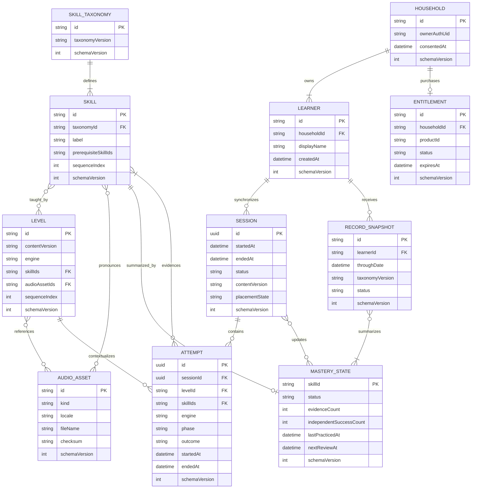
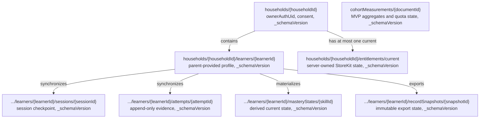

# Data model

This document implements ADR-000 D4, D6, D7, and D10. A skill is the unit of instruction and
record; a level is only an encounter that can produce evidence about one or more skills. No
schema may infer mastery from a level counter or mix rewards with learning evidence.

## Logical domain model

`Household`, `Learner`, `RecordSnapshot`, and `Entitlement` do not exist in the MVP. They enter
together with the parent account in the post-MVP record phase. The MVP's `Session` has no learner
identifier. At upgrade, the parent deliberately associates this installation's local history
with a newly selected `Learner`.

## Entity contracts

| Entity | Contract |
| --- | --- |
| `SkillTaxonomy` | Immutable, versioned graph of skills and prerequisites. Its version is stamped into sessions and exports so labels remain interpretable later. |
| `Skill` | Stable semantic ID, parent-readable label, description, prerequisite IDs, and scope-and-sequence position. IDs survive copy edits. |
| `Level` | Immutable content encounter with a closed engine value, one or more skill IDs, recorded-audio IDs, and example words. Completing it is not itself mastery. |
| `Attempt` | One modeled, guided, independent, or mastery-check interaction. It stores an outcome and bounded engine metrics, never raw touch paths or voice. Abandonment is evidence of an incomplete item, not a wrong answer. |
| `MasteryState` | Derived state per skill: `unseen`, `introduced`, `practicing`, `reviewDue`, or `mastered`, with evidence counts and review timing. The transition policy is owned by `PacingEngine`, not persistence. |
| `Session` | Atomic work interval with a clean-exit checkpoint, content/taxonomy versions, placement state, and attempt relationship. `active`, `completed`, and `abandoned` are the only statuses. |
| `AudioAsset` | Manifest metadata for one bundled recording: phoneme, grapheme name, example word, instruction, or encouragement. The checksum binds content validation to the shipped bytes. |
| `Household` | Post-MVP parent-owned security and consent boundary keyed to a Sign in with Apple-backed Firebase user. |
| `Learner` | Post-MVP parent-created record subject inside one household. No school roster or school-provided identifier is accepted. |
| `RecordSnapshot` | Immutable, exportable summary of evidence and mastery through a stated date and taxonomy version. It does not claim diagnosis. |
| `Entitlement` | Server-maintained StoreKit 2 access state for paid record features; it never gates instruction. |

## Bundled content and SwiftData

`SkillTaxonomy`, `Skill`, `Level`, and `AudioAsset` metadata are decoded from validated,
versioned bundle JSON. The audio bytes are bundle resources. They are not copied into SwiftData
and are never fetched at runtime. `contentVersion` and `taxonomyVersion` make a historical
attempt resolvable against the repository release that taught it.

Mutable local state uses a versioned SwiftData schema. The implementation names below are
normative; persistence adapters map them to the Domain value types rather than exposing
`@Model` objects to Domain.

| SwiftData model | Required fields | Index/uniqueness and write rule |
| --- | --- | --- |
| `SDSession` | `id: UUID`, `startedAt: Date`, `endedAt: Date?`, `statusRaw: String`, `contentVersion: String`, `taxonomyVersion: String`, `placementBlob: Data`, `checkpointLevelID: String?`, `schemaVersion: Int` | Unique `id`. Insert at start; update checkpoint, status, and end time in one model-actor transaction. |
| `SDAttempt` | `id: UUID`, `sessionID: UUID`, `levelID: String`, `skillIDs: [String]`, `engineRaw: String`, `phaseRaw: String`, `outcomeRaw: String`, `metricsBlob: Data`, `startedAt: Date`, `endedAt: Date`, `schemaVersion: Int` | Unique `id`; index `sessionID` and `endedAt`. Append-only after the containing transaction commits. |
| `SDMasteryState` | `skillID: String`, `statusRaw: String`, `evidenceCount: Int`, `independentSuccessCount: Int`, `lastPracticedAt: Date?`, `nextReviewAt: Date?`, `updatedAt: Date`, `schemaVersion: Int` | Unique `skillID`. Upsert in the same transaction as the evidence attempt. |
| `SDAppState` | `singletonID: String`, `firstOpenedAt: Date`, `activeSessionID: UUID?`, `contentVersion: String`, `taxonomyVersion: String`, `migrationStateBlob: Data?`, `schemaVersion: Int` | Exactly one row with `singletonID = "app"`. It points to the resumable local checkpoint. |
| `SDCohortBatch` | `id: UUID`, `periodStart: Date`, `periodEnd: Date`, three integer counters, `stateRaw: String`, `attemptCount: Int`, `nextRetryAt: Date?`, `schemaVersion: Int` | Unique `id`; contains aggregate D6 counters only. Delete on accepted upload or revocation. |

Every SwiftData row carries `schemaVersion`, including singleton and queue records. Engine metrics
are closed, versioned Codable payloads selected by `engineRaw`: tracing persists only accuracy
and coverage; blending persists completed phoneme count and independent completion; word
building persists correct-position count and independent completion. Raw touch points, haptic
events, narration timing, audio, voice, and UI event streams are neither fields nor blobs.

The record repository commits an attempt, affected mastery states, and the session checkpoint in
one `ModelActor` transaction. If the transaction fails, none of the three advances. A retry uses
the same UUID, making it idempotent.

## Post-MVP Firestore collections

All Firestore documents carry `_schemaVersion: number`; no adapter may default a missing version
to the current version. The cohort collection exists in the MVP but is not linked to household,
learner, auth UID, or local record IDs. Its exact write contract is in
[backend architecture](backend-architecture.md).

Firestore paths and ownership are:

| Collection | Writer | Reader | Mutability |
| --- | --- | --- | --- |
| `households` | Record API after verified parent auth and consent | Household owner through API | Profile fields update; consent facts append |
| `learners` | Parent through Record API | Household owner through API | Parent-managed; deletion follows record policy |
| `sessions` | Idempotent sync API | Household owner through API | Upsert until completed, then immutable except migration |
| `attempts` | Idempotent sync API | Household owner through API/export job | Append-only |
| `masteryStates` | Sync transaction or server recomputation | Household owner through API/export job | Derived upsert |
| `recordSnapshots` | Export job | Household owner through signed, expiring download | Immutable |
| `entitlements` | App Store notification handler | Record API; parent receives a projected status | Server-owned |
| `cohortMeasurements` | `cohortIngest` Admin SDK only | No application client | Append/idempotent batch plus quota documents; study deletion only |

Firestore rules deny direct client access by default. Post-MVP web and iOS clients call Functions
with a Firebase ID token; Functions verify that `request.auth.uid` owns the path's household.
The client never chooses an arbitrary household owner UID.

## Residency and sync classification

| Data | MVP | Post-MVP after parent gate | Must never leave the device |
| --- | --- | --- | --- |
| Skill taxonomy, levels, audio manifest, audio bytes | Read-only app bundle | Still bundled; server export code packages the matching taxonomy separately | The device never uploads these assets |
| Attempts, mastery states, sessions, placement state | SwiftData only | Sync to the selected learner after consent; local copy remains | Before the D7 gate, all of it |
| Raw tracing strokes and anchors | Memory for the active evaluation only | Same | Always |
| Voice or read-aloud recording | Not collected | Not introduced by this architecture | Always |
| Rewards, haptics, narration interactions | Local transient UI state; not learning evidence | Same | Always; they are not part of the record |
| D6 cohort counters | Local weekly aggregate until upload | Study remains separate from household data | Attempts, skill IDs, dates of individual sessions, and record IDs never accompany the counters |
| Cohort code and participant token | Keychain, only while opted in | Destroyed on revocation/study close | Raw code/token are not written into learning records; server stores keyed hashes only |
| Household, learner, consent, entitlement | Does not exist | Firestore after parent action | Not applicable before the gate |
| Record snapshot/export | Does not exist | Cloud snapshot plus parent-downloaded file | No third-party recipient is built in |

## Migration discipline

Every local and cloud change follows **expand, migrate, contract**:

1. **Expand.** Ship readers that understand old and new versions, add optional new fields or a
   parallel model/collection, and keep old fields intact. Reject unknown future versions.
2. **Migrate.** Export first, transform bounded batches, stamp the target version, verify record
   counts and deterministic checksums, checkpoint only after writes commit, and quarantine data
   that cannot be validated. Re-running skips target-version records.
3. **Contract.** In a later release, after the previous app version is outside the supported
   window and verification has remained clean, stop writing the old shape. Destructive cleanup
   is a separate migration and never shares a release with expansion.

Before the first SwiftData migration ships, the app must expose a parent-gated **Export local
record** action. It writes an atomic package containing a manifest, schema/content/taxonomy
versions, all sessions, attempts, and mastery states, plus a SHA-256 checksum. It includes no raw
strokes or cohort credentials. A preflight also creates an encrypted app-sandbox backup before a
custom migration begins. On failure, the app reopens the old store read-only, preserves both the
store and export, and offers the Files share sheet; it never creates a fresh empty store over the
failed one.

The Firestore side uses the existing `scripts/migrate.mjs` runner. It already provides explicit
project selection, dry-run planning, bounded batches, post-write checkpoints, idempotent schema
stamps, quarantine, and non-destructive expansion. New record migrations must implement that
runner's migration contract rather than introduce ad hoc scripts.

## Invariants

- A `Level` without at least one `skillID` cannot decode.
- An `Attempt` references the exact content and taxonomy versions recorded by its `Session`.
- Mastery can be recomputed from attempts under a named pacing-policy version; rewards cannot
  affect it.
- Cohort aggregates cannot be joined to a household or learner model.
- Cloud migration commits only after local and staged-cloud counts and checksums agree.
- No migration deletes the only readable copy of a local record.
