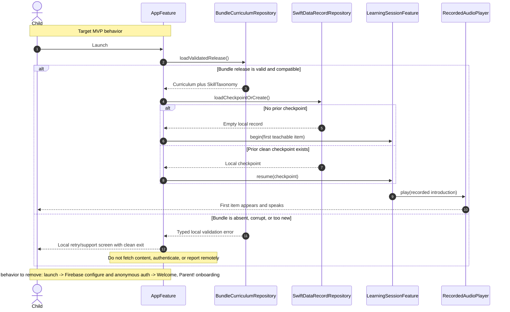

# Runtime flows

These sequences implement ADR-000 D1-D7 and D10. They show required failure behavior, not only
the happy path. Data and network boundaries use the components defined in the other architecture
documents.

## 1. Cold start, first-ever session

The MVP removes the shipping `Welcome, Parent!` onboarding, name/age/focus form, anonymous
Firebase sign-in, remote hydration, and paywall branches. A first launch enters the first teaching
item with no account and no network request (D1 and D7).



The error screen can retry bundle decoding or exit. It must not offer sign-in, content download,
email capture, or a diagnostic upload. A fresh local database is created only when no database
exists, never when an existing database failed to migrate.

## 2. Teaching loop

```mermaid
sequenceDiagram
    autonumber
    actor Child
    participant Feature as ActivityFeature
    participant Audio as RecordedAudioPlayer
    participant Engine as Domain activity engine
    participant Session as LearningSessionFeature
    participant Pace as PacingEngine
    participant Store as SwiftDataRecordRepository

    Feature->>Audio: play(introduce sound)
    opt Child interrupts any narration
        Child->>Feature: Skip or acts on item
        Feature->>Audio: stop()
        Audio-->>Feature: Cancelled completion
        Note over Feature,Session: Narration skip is not failure evidence
    end
    Feature->>Audio: play(model)
    Feature->>Engine: reduce(model interaction)
    Engine-->>Feature: Modeled state
    Feature->>Engine: reduce(guided practice action)
    Engine-->>Session: Guided evidence
    Feature->>Engine: reduce(independent action)
    Engine-->>Session: Independent evidence
    Session->>Engine: evaluate(mastery-check action)
    Engine-->>Session: SkillEvidence
    Session->>Pace: next(mastery, evidence, curriculum, agency)
    alt Evidence supports advance
        Pace-->>Session: Advance to next teaching or due review
        Session->>Store: Commit attempt, mastery, checkpoint atomically
        Store-->>Session: Committed
    else Evidence calls for review
        Pace-->>Session: Short retry, easier model, or later review
        Session->>Store: Commit attempt and review due date atomically
        Store-->>Session: Committed
        Note over Child,Pace: No remedial lecture and no forced repetition loop
    else Persistence fails
        Store-->>Session: Error; transaction rolled back
        Session-->>Child: Keep current item and offer retry or clean exit
    end
    opt Child exits at any moment
        Child->>Session: Exit
        Session->>Audio: stop()
        Session->>Store: Save recoverable checkpoint
        Session-->>Child: Return immediately
    end
```

Introduce, model, guided practice, independent practice, and mastery check are attempt phases, not
separate level-completion rewards. Every narration call has a visible skip action and is cancelled
when the child interacts, navigates, or exits.

## 3. Placement inference in the first session

```mermaid
sequenceDiagram
    autonumber
    actor Child
    participant Session as LearningSessionFeature
    participant Place as PlacementEngine
    participant Pace as PacingEngine
    participant Store as SwiftDataRecordRepository

    Session->>Place: infer(no evidence, taxonomy, easier-biased policy)
    Place-->>Session: Begin at earliest reasonable skill
    Session-->>Child: Teach first real item
    loop After each early guided or independent item
        Child->>Session: Respond, skip narration, retry, or exit
        Session->>Place: infer(prior state, accumulated SkillEvidence)
        alt Repeated strong independent evidence
            Place-->>Session: Increase confidence and skip secure prerequisites
            Session->>Pace: Select next reachable teaching item farther ahead
        else Failure, abandonment, or conflicting evidence
            Place-->>Session: Keep or move earlier; confidence remains low
            Session->>Pace: Select modeled or guided item at easier position
            Note over Session,Child: No failure label, placement score, or remedial lecture
        else Evidence is insufficient
            Place-->>Session: Preserve easier position and gather another teaching item
        end
        Session->>Store: Save placement state with attempt transaction
        alt Local save fails
            Store-->>Session: Roll back inference update
            Session-->>Child: Continue current item or exit; never restart as a test
        else Local save succeeds
            Store-->>Session: Checkpoint committed
        end
    end
    Note over Child,Place: The child sees teaching throughout; there is no assessment screen
```

Placement is provisional for the first session and becomes ordinary pacing state afterward. The
system measures its usefulness through week-two continuation, not a displayed accuracy score.

## 4. Consented cohort measurement

This is the only MVP network flow. The code is issued only for a signed cohort consent artifact.
The participant token is generated randomly on the device and has no account, name, advertising
identifier, vendor identifier, or Firebase UID.

```mermaid
sequenceDiagram
    autonumber
    actor Parent
    participant Gate as Parent-gated CohortSettingsFeature
    participant Keychain as Keychain cohort state
    participant Aggregate as Local aggregate store
    participant Client as CohortUploadClient
    participant Ingest as cohortIngest Function
    participant DB as cohortMeasurements

    Parent->>Gate: Enter issued cohort code
    alt Code fails local format check
        Gate-->>Parent: Invalid format; remain off
    else Code format is valid
        Gate->>Keychain: Store code and device-generated random token
        Gate-->>Parent: Study mode on, visible, revocable
    end
    loop Each completed local week while enabled
        Aggregate->>Aggregate: Count sessions started, skills reached, days since first open
        Client->>Keychain: Read active code and token
        Client->>Ingest: POST weeklyBatch with aggregate counters
        alt Offline or timeout
            Ingest--xClient: No accepted response
            Client->>Aggregate: Keep one idempotent batch and schedule bounded retry
        else Code invalid, expired, or revoked
            Ingest-->>Client: 401 cohort_code_invalid
            Client->>Aggregate: Keep batch; stop automatic retries
            Client-->>Gate: Show parent action required
        else Rate limited
            Ingest-->>Client: 429 rate_limited with retryAfterSeconds
            Client->>Aggregate: Keep batch until allowed time
        else Valid request
            Ingest->>DB: Transactionally write batch and quota document
            DB-->>Ingest: Committed or already exists
            Ingest-->>Client: 202 accepted with nextUploadAfter
            Client->>Aggregate: Delete accepted local batch
        end
    end
    Parent->>Gate: Revoke study participation
    Gate->>Client: Cancel in-flight task
    Gate->>Aggregate: Delete queued cohort batches
    Gate->>Keychain: Read credential once, then delete persisted code and token
    opt Network is available at revocation
        Client->>Ingest: POST revoke using the in-memory credential
        Ingest->>DB: Mark token revoked and delete its retained batches per study policy
        Ingest-->>Client: 202 revocation accepted
    end
    Gate->>Client: Discard in-memory credential
    Gate-->>Parent: Study mode off; teaching remains fully available
```

If the best-effort remote revocation cannot run, local revocation still takes effect immediately
and no further upload occurs. The consent artifact defines the contact path for server-side
deletion. Study close destroys code hashes, participant-token hashes, and retained batches.

## 5. Post-MVP parent record upgrade and local-history migration

This flow is absent from the MVP build. It arrives as one gated capability: parental gate,
purchase, account/consent, and migration. Counsel question Q1 in ADR-000 determines whether an
additional verifiable-parental-consent step must be inserted; this diagram does not answer it.

```mermaid
sequenceDiagram
    autonumber
    actor Parent
    participant App as RecordUpgradeFeature
    participant StoreKit as StoreKit 2
    participant AppleID as Sign in with Apple
    participant Local as SwiftData record repository
    participant API as Record API
    participant Stage as Firestore migration staging
    participant Cloud as Firestore learner record

    Parent->>App: Open paid record
    App->>App: Present and verify parental gate
    alt Gate fails or is cancelled
        App-->>Parent: Return to free app; local history unchanged
    else Gate passes
        App->>StoreKit: Purchase annual record entitlement
        alt Purchase cancelled, pending, or unverified
            StoreKit-->>App: No verified entitlement
            App-->>Parent: Return or retry; instruction and local history remain available
        else Verified purchase
            StoreKit-->>App: Verified transaction
            App->>AppleID: Create or authenticate parent account
            alt Sign in or required consent is incomplete
                AppleID-->>App: Cancelled or failed
                App-->>Parent: Preserve purchase receipt and local record; resume setup later
            else Parent identity and consent gate complete
                AppleID-->>App: Firebase ID token
                App->>Local: Export versioned snapshot and checksum before migration
                Local-->>App: Immutable local migration package
                App->>API: Begin migration with manifest and idempotency key
                API->>Stage: Create household-scoped staging record
                loop Bounded upload chunks
                    App->>API: Upload sessions, attempts, mastery plus checksums
                    API->>Stage: Validate schema, ownership, and idempotency
                end
                API->>Stage: Compare manifest counts and checksums
                alt Upload, validation, entitlement, or checksum fails
                    Stage-->>API: Reject or quarantine staging set
                    API-->>App: Migration not committed with retry token
                    App->>Local: Keep local store authoritative and export intact
                    App-->>Parent: Explain retry; no history was moved or deleted
                else Staged record matches local manifest
                    Stage-->>API: Verified
                    API->>Cloud: Atomically commit staging generation as active learner record
                    Cloud-->>API: Commit generation ID
                    API-->>App: Migration committed with server manifest
                    App->>Local: Verify server manifest, then enable incremental sync
                    App-->>Parent: Record ready; local history retained
                end
            end
        end
    end
```

Rollback means abandoning or quarantining the uncommitted cloud staging generation and continuing
to read the untouched local database. The implementation never "moves" records by deleting them
locally. A later, separately authorized retention policy may compact synchronized local data, but
not as part of account creation or the first migration.
