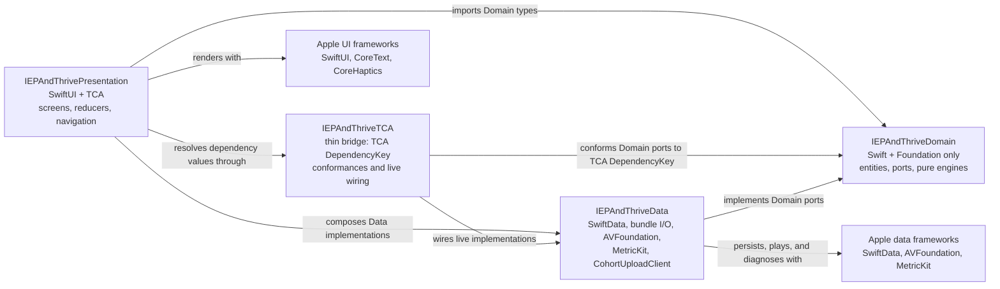
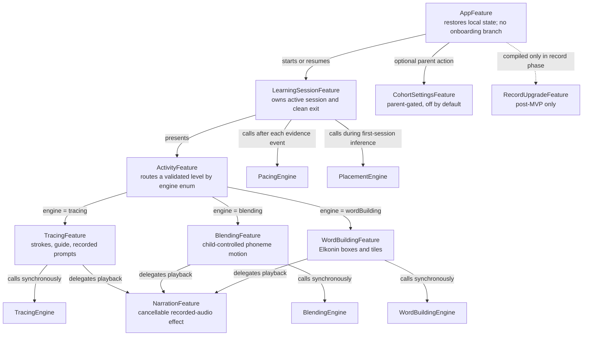

# iOS client architecture

This is the implementation design for ADR-000 D1-D5, D7, D9, and D10. It replaces the shipping
shape in which the app target mixes SwiftUI, TCA, SwiftData, Firebase, Google Sign-In,
Crashlytics, StoreKit, synthesized speech, and pedagogy in one module. It does not authorize the
post-MVP account code to remain in the MVP target.

## Module graph and one-way rule

Create four build targets so the compiler, rather than convention, owns the boundary. The
arrows below mean "may import." They point inward. Domain has no outgoing import edge. The thin
TCA bridge is the only target that knows both the Domain protocols and TCA's dependency
infrastructure.



`IEPAndThriveDomain` imports nothing beyond Foundation. It defines abstract repository/effect
protocols and pure value types; it does not define TCA conformances. It must not import SwiftUI, TCA,
SwiftData, CoreGraphics, CoreText, UIKit, AVFoundation, MetricKit, Firebase, or networking
frameworks. The `IEPAndThriveTCA` bridge imports TCA, Domain, and the Data implementations; it
conforms the Domain protocols to `DependencyKey` and exposes the live/test values to Presentation.
Data may depend on Domain; Presentation may compose both. Domain never depends on Data,
Presentation, or the bridge, and Data never depends on Presentation.

Add a pre-compilation CI/build phase named `Enforce Domain Imports`. It enumerates Swift files
belonging to the Domain target, extracts every `import` declaration, and fails unless the import
is exactly `Foundation`. A second check fails if a Domain source is accidentally assigned to the
Data or app target, or if Data/Presentation source membership is added to the Domain target.
The same job inspects the generated target dependency graph and requires
`Presentation -> Data -> Domain` plus `Presentation -> TCA bridge -> Data -> Domain`, with
Presentation's direct Domain import allowed for value types. This keeps dependency registration
out of Presentation without weakening the Foundation-only Domain rule. This is the D9 release
gate.

## Domain engines

All engine inputs and outputs are immutable, `Equatable`, and `Sendable` value types. An engine
method performs no I/O, reads no clock or random generator, and mutates no global state. Dates,
random choices, thresholds, and content are explicit inputs. The signatures below are the public
Domain API; adapters translate UIKit/CoreText points, SwiftData models, or JSON DTOs at the layer
boundary.

```swift
public enum TracingEngine {
    public static func fitTransform(
        contentBounds: Rect2D,
        canvas: Rect2D,
        padding: Double
    ) -> AffineTransform2D

    public static func evaluate(
        attempt: TraceAttempt,
        template: GlyphTemplate,
        policy: TracingPolicy
    ) -> TraceResult
}

public enum BlendingEngine {
    public static func reduce(
        state: BlendingState,
        action: BlendingAction,
        word: DecodableWord
    ) -> BlendingResult
}

public enum WordBuildingEngine {
    public static func reduce(
        state: WordBuildingState,
        action: WordBuildingAction,
        word: DecodableWord
    ) -> WordBuildingResult
}

public enum PlacementEngine {
    public static func infer(
        prior: PlacementState,
        evidence: [SkillEvidence],
        taxonomy: SkillTaxonomy,
        policy: PlacementPolicy
    ) -> PlacementDecision
}

public enum PacingEngine {
    public static func next(
        mastery: [SkillID: MasteryState],
        recentEvidence: [SkillEvidence],
        curriculum: Curriculum,
        now: Date,
        agency: LearnerAgency
    ) -> PacingDecision
}
```

### `TracingEngine`

The engine compares a child's normalized strokes with normalized outline anchors and returns
accuracy, coverage, and evidence; it does not grade handwriting or identify a child. CoreText
path extraction remains an adapter outside Domain and converts its result to `GlyphTemplate`.

The shipping `LetterTracer.makeLetterPath` flips and centers a glyph path but never scales it.
Consequently a two-glyph blend can retain an approximately 1,236-point outline on a roughly
350-point canvas. Centering that oversized path merely clips both ends and makes its validation
anchors unreachable. The fix is an aspect-fit scale before the final translation:

```text
availableWidth  = max(0, canvas.width  - 2 * padding)
availableHeight = max(0, canvas.height - 2 * padding)
scale = min(1, availableWidth / bounds.width, availableHeight / bounds.height)
```

`fitTransform` applies that uniform scale, then translates the scaled bounds to the canvas
center. It restores this invariant: **for every non-empty glyph sequence, the transformed union
of glyph bounds is centered and wholly contained inside the drawable canvas inset by `padding`,
within floating-point tolerance**. The same transform must be applied to the visible guide,
outline anchors, and hit-test path. Never fit each glyph independently, because that changes
spacing and makes the drawn guide differ from the evaluated template.

### `BlendingEngine`

This new engine models ordered phonemes being pushed together into a decodable word. The child,
not a timer or narration callback, controls the blend position and pace. It emits which recorded
audio asset should play next and whether the current independent blend is evidence for each
skill. Audio playback itself is a Data effect and cannot affect the pure result.

### `WordBuildingEngine`

This new engine creates one Elkonin box per phoneme, never per character. Its input
`DecodableWord` therefore carries an ordered phoneme list and permitted grapheme tiles. A result
reports exact phoneme-position matches, misplaced tiles, completion, and skill evidence. The
engine does not infer phonemes from spelling at runtime; that mapping is educator-authored and
CI-validated under D3.

### `PlacementEngine`

This new engine implements D5 without a test screen or a placement score. It consumes evidence
generated by real teaching items in the first session. With absent or ambiguous evidence it
selects the earliest reasonable prerequisite. Strong independent evidence can skip already
secure prerequisites quickly; failed or abandoned items lower confidence and never trigger a
remedial lecture. The policy's tie-break always chooses the easier of two plausible starting
positions.

### `PacingEngine`

This new engine selects instruction and spaced review from skill mastery, due dates, and recent
evidence. `LearnerAgency` includes `narrationSkipped`, `wantsAnotherItem`, and `exitRequested`.
An exit request always returns `.endSession(saveCheckpoint: true)`. Skipping narration never
counts as a failed attempt. Failure returns a short retry, an easier modeled item, or a later
review; it never returns a remedial lecture. All narration commands are cancellable.

## TCA feature tree



`AppFeature` restores the last checkpoint and immediately sends
`LearningSessionFeature.Action.begin`; it has no onboarding, sign-in, paywall, child picker, or
remote hydration branch in the MVP. `LearningSessionFeature` owns the session ID, selected
level, attempt lifecycle, placement state, mastery state, and clean-exit checkpoint.
`ActivityFeature` switches only over the closed content `engine` enum, so it has no fallback that
turns an unknown string into a tracing target.

Each activity reducer calls its engine synchronously inside the reducer for cheap pure work.
It returns engine-specific evidence to `LearningSessionFeature`, which calls `PlacementEngine`
during the first session, updates skill mastery, then calls `PacingEngine` for the next item.
Data dependencies are TCA dependency values whose interfaces use Domain types:

| Port | Data implementation | Concurrency and cancellation rule |
| --- | --- | --- |
| `CurriculumRepository` | Versioned bundle JSON decoder | Load once in an actor; reject an incompatible corpus before a session begins |
| `LearningRecordRepository` | SwiftData model actor | Serialize writes; persist attempt and checkpoint atomically |
| `RecordedAudioPlayer` | Retained `AVAudioPlayer` actor | `play` awaits completion; `stop` and task cancellation stop immediately |
| `DiagnosticsRepository` | MetricKit adapter plus local bounded diagnostic store | No network transport |
| `CohortMeasurementPort` | `CohortUploadClient` | Construct only for a valid, unrevoked cohort state; cancel on revocation |

Long-running work uses structured concurrency through TCA effects. Every effect has a stable
cancellation ID scoped to the session or narration. Leaving an activity cancels its audio and
haptics before saving the checkpoint. No detached task may outlive its owning feature.

## Phase-specific target composition

The MVP application target must not link Firebase Auth, Firebase Firestore, Firebase
Crashlytics, Google Sign-In, or StoreKit purchase features. The D6 transport is a tiny first-party
Data implementation. The post-MVP record configuration adds Sign in with Apple, StoreKit 2, and
authenticated Firestore/API adapters together behind the parent gate described in D7. Build
configurations must not use compile flags to make forbidden MVP clients dormant; they must be
absent from the MVP target dependency graph.

## Decision trace

| Structural rule | ADR-000 source |
| --- | --- |
| No default network and one socket-capable Data type | D1, D6, D9 |
| Recorded, interruptible instructional audio | D2 |
| Closed engine routing over bundle data | D3 |
| Evidence and mastery indexed by skill | D4 |
| Silent, easier-biased placement inside teaching | D5 |
| Account/payment code excluded from MVP | D7 |
| Three compiler-enforced layers and pure engines | D9 |
| Atomic, versioned local persistence | D10 |
