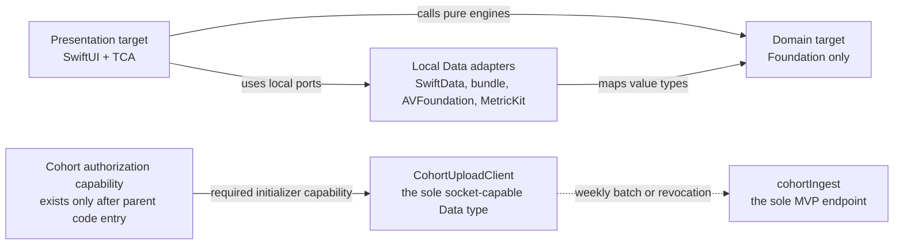

# Privacy architecture

This document turns ADR-000 D1, D2, D6, D7, D9, and D10 into enforceable boundaries. It is an
engineering design, not a legal conclusion. The four unresolved counsel questions are carried
unchanged at the end.

## Enforced MVP boundary

The free teaching path is denied networking by construction. The only socket-capable source type
is `CohortUploadClient` in the Data layer. It is a small first-party `URLSession` adapter whose
initializer requires an active, unrevoked `CohortAuthorization` value. No feature can create that
value except the parent-gated D6 code flow.

The MVP app target does not link Firebase Core, Auth, Firestore, Crashlytics, Google Sign-In,
analytics, advertising, remote configuration, or a general HTTP client. Removing calls while
leaving those SDKs linked is insufficient because initialization and transitive behavior can
still open a connection.

### Build and release enforcement

The `Enforce Network Boundary` build phase and CI job perform all of these checks:

1. Search compiled MVP source for imports of `Network`, `CFNetwork`, Firebase modules,
   Google Sign-In, WebKit, and third-party analytics or HTTP SDKs. No matches are allowed.
2. Search uses of `URLSession`, `URLRequest`, stream/socket APIs, and `NWConnection`. The only
   allowlisted file and owning type are `IEPAndThriveData/Cohort/CohortUploadClient.swift` and
   `CohortUploadClient`; an allowlisted directory or filename pattern is forbidden.
3. Inspect the linked binary/framework manifest. Network-capable third-party SDKs fail the build,
   even if source scanning finds no call.
4. Run a first-launch-through-full-session integration test with cohort state absent and a
   `FailOnUseTransport`. The test asserts zero transport calls while launching, loading content,
   hearing all narration, completing correct and incorrect items, saving, exiting, and resuming.
5. Run the same session with a valid cohort capability but a week not due. It still asserts zero
   calls. A separate D6 contract test proves only a due batch or explicit revocation can call the
   one endpoint.

Together the static allowlist prevents another type from acquiring a socket API, the link audit
prevents an SDK side door, and the runtime invariant proves the normal dependency composition
does not invoke the one permitted transport. These are release gates under D1, not advisory lint.

## Data classes

| Data class | Collected or generated | Location | Who can read it | Retention/deletion |
| --- | --- | --- | --- | --- |
| Bundled curriculum and recorded audio | Product content, no child data | Read-only app bundle | Anyone with the installed app | Replaced by App Store update; historical source releases retained for record interpretation |
| Session, attempt, skill evidence, mastery, placement | Generated while teaching; no name or account in MVP | SwiftData on the device | Local app; a person with device access | Until local reset/app deletion; export and migration safeguards apply before schema change |
| Raw tracing stroke points | Generated during one tracing interaction | Memory only | Active `TracingEngine` call | Released after summarized accuracy/coverage is committed; never persisted |
| Voice/read-aloud data | Not collected by this architecture | Nowhere | Nobody | Not applicable |
| Rewards, haptics, UI interaction stream | Generated for immediate experience | Memory; bounded local reward state if needed | Local app | UI state expires with session; it is never learning evidence or cohort data |
| Local MetricKit payload and bounded diagnostic summary | Delivered by the operating system | Device-local diagnostic store | Local app and device owner through an explicit export | Rotate by count/size; clear on local reset; no app-operated upload |
| Declared age-range result | Returned by Apple's API for the immediate age-appropriate branch | Memory only | Parent-gate coordinator | Convert to the minimum Boolean/range decision, then discard before the flow ends; never log or persist the signal |
| Cohort consent state | Issued study code plus device-generated participant token | Keychain | Parent-gated cohort feature and `CohortUploadClient` | Delete immediately on revocation and at study close |
| Cohort aggregate batch | Sessions started, skills reached, days since first open | SwiftData queue, then write-only Firestore collection | Local cohort client before acceptance; privileged study operator under the consent artifact after receipt | Local copy deleted on acceptance/revocation; server expiry comes from the signed study retention date, then batch and token hash are destroyed |
| Network metadata at cohort ingress | Transport metadata necessarily received by hosting infrastructure | Provider request logs, not Firestore application documents | Restricted infrastructure operators | Configure the shortest operational retention supported and document it in the study artifact before recruitment; never copy it into cohort records |
| Parent identity and consent | Post-MVP only; Sign in with Apple subject/private relay and consent facts | Firebase Auth and household record | Parent and authorized record services | Account deletion/retention workflow defined before record-phase launch |
| Learner profile and synchronized record | Post-MVP, entered/selected by the parent | Device plus household-scoped Firestore | Household owner and authorized export service | Parent-controlled deletion and export; exact statutory/business retention requires approved policy before launch |
| StoreKit transaction and entitlement | Post-MVP purchase evidence | Apple plus server-owned entitlement document | Parent receives projected status; entitlement service reads source record | Follow transaction-record policy; never used to gate free instruction |
| Parent export | Parent-requested record package | Expiring server object and parent-selected file location | Requesting household owner | Server copy expires on the documented job TTL; parent controls downloaded copy |

No MVP table row contains a child name, email, Firebase UID, advertising identifier, vendor
identifier, device identifier, IP address, raw touch path, or voice sample. The D6 batch contains
only its three approved counters, period, schema version, idempotency ID, and keyed participant
token hash.

## MetricKit instead of remote crash reporting

The MVP removes Firebase Crashlytics and its dSYM upload build phase from the app target. A
`MetricKitDiagnosticsAdapter` receives Apple's daily metric and diagnostic payloads, extracts a
bounded allowlist of crash/hang signature, app version, device-class bucket, and performance
aggregates, and stores them locally. It must not attach lesson IDs, skill IDs, stroke data,
participant tokens, breadcrumbs, names, or free text. A parent-gated export can place the local
diagnostic package in the Files share sheet; it cannot transmit automatically.

App Store/Xcode Organizer diagnostics made available by Apple can still inform releases, but D1
means the app itself has no remote diagnostic transport. We deliberately lose real-time crash
alerts, non-fatal error reporting, per-user/session timelines, custom breadcrumbs, remote logs,
installation counts, immediate affected-version segmentation, and the ability to contact or
identify an affected family. Tests and reproducible local diagnostic exports carry more weight
because that loss is real.

## Kids Category position

ADR-000 D1 decides that the app enters Apple's Kids Category. The build therefore has no
third-party analytics or advertising, no behavioral tracking, and no external-link, account, or
purchase path accessible from the child surface. All post-MVP purchase, identity, consent,
support-link, and export actions are behind a parental gate. Instructional audio is bundled and
recorded under D2; system synthesis is not used to improvise phonics content.

The App Store privacy manifest and listing must describe the compiled binary, not the intended
flow. CI compares declared SDKs/data uses with the target's dependency and privacy manifests. A
binary containing Firebase or Google Sign-In cannot pass as the D1 MVP merely because its UI is
hidden.

## Regulatory attachment points

These are engineering attachment points for review, not answers about legal sufficiency.

| Regime/interface | Architecture attachment | Required engineering evidence |
| --- | --- | --- |
| Amended COPPA Rule | D1 no-collection free tier; D6 separate signed cohort artifact; D7 point where parent identity and learner record first enter | Network-boundary test, data inventory, retention/deletion implementation, consent-flow evidence, SDK/link manifest |
| Texas App Store Accountability Act | Launch/parent-gate coordinator before any age-dependent post-MVP capability | Declared Age Range API adapter test; proof that the returned signal is minimized, never logged/persisted, and deleted after use |
| Apple's Declared Age Range API | Data adapter that returns only the minimum Domain age-range decision to the gate | Unit test for unavailable/declined/restricted results and source scan proving no persistence or cohort inclusion |
| Apple Kids Category | App target dependencies, navigation, parental gates, privacy manifest, App Store metadata | No analytics/ads, external-action gate tests, dependency audit, recorded-audio manifest |

An unavailable or declined age-range response fails closed for parent-only capabilities while
leaving free instruction available. It must not trigger a general network fallback, request a
birth date from the child, or become a placement input.

## Post-MVP boundary change

D7 permits authenticated network traffic only after the parent passes the gate, purchase and
consent requirements are satisfied, and a household exists. The sync adapter receives a
short-lived Firebase ID token and a household scope; it cannot write an owner UID supplied by
the caller. Local history remains authoritative until staged cloud counts and checksums match.
Revoking record sync stops new traffic without corrupting local learning. D6 cohort identity and
D7 household identity remain separate namespaces and are never joined.

## Open counsel questions from ADR-000

These questions are intentionally unanswered and all must be resolved before the record phase:

| # | Question | Owner | Blocks |
| --- | --- | --- | --- |
| Q1 | Does StoreKit purchase satisfy verifiable parental consent? | counsel | upgrade flow design, post-MVP |
| Q2 | Did the 2025 COPPA amendments add a notice requirement to the internal-operations exception? | counsel | nothing; confirms D1 |
| Q3 | Does on-device-only speech processing constitute "collection"? | counsel | any future read-aloud check |
| Q4 | Does stroke data from the tracing canvas qualify as a biometric identifier? | counsel | nothing under D1; matters if D1 is ever relaxed |

No implementation may answer one of these by inference. A resolved answer that changes a binding
boundary requires a successor ADR and corresponding privacy/test updates.
