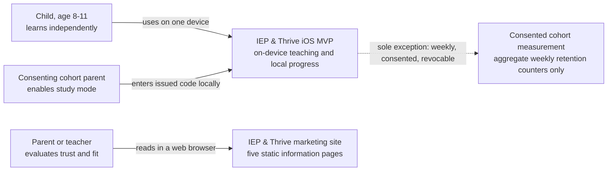
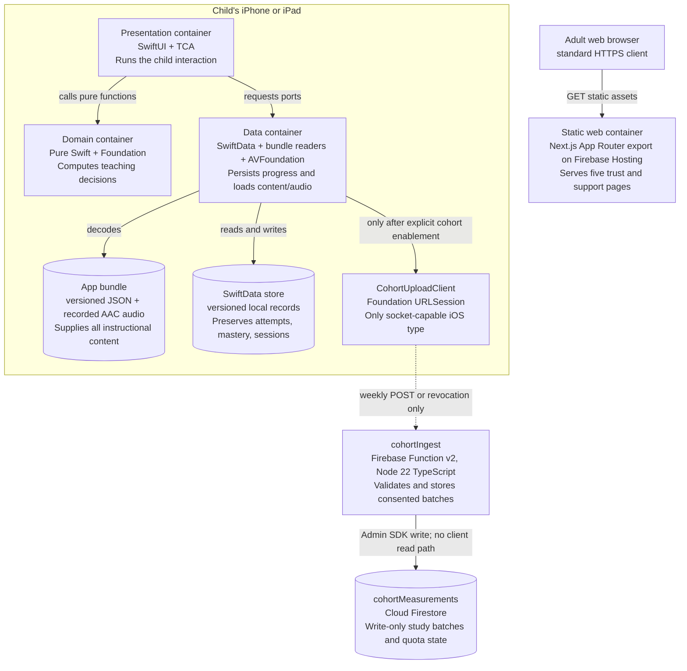
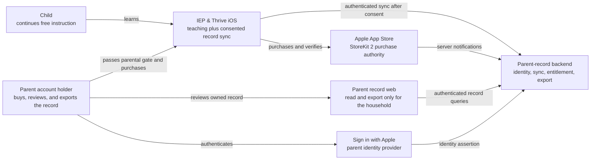
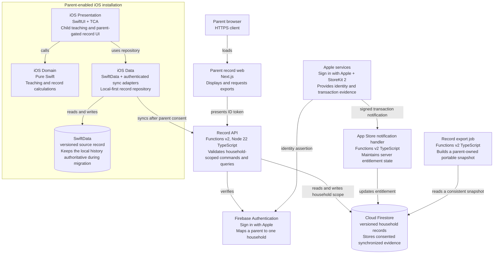

# System overview

This document defines the system boundary for the MVP and the post-MVP parent record. It
implements ADR-000 D1 and D6-D9. It is a topology, not a restatement of the
[product brief](../research/2026-09-06-product-brief.md).

## MVP C4 context

The default child experience has no line to any remote system. The dashed cohort line exists
only after a parent has joined the recruited study, supplied its separate consent artifact, and
entered the issued code. It is the sole D6 exception to D1.

There is no account, remote content service, learner API, analytics service, advertising SDK,
remote crash reporter, or push service in this context. Content and audio arrive inside the App
Store bundle. Marketing-site traffic is traffic from an adult's browser to a separate system;
it is not traffic from the child app.

## MVP C4 containers

| Container | Technology | One responsibility | Decision source |
| --- | --- | --- | --- |
| Presentation | SwiftUI and The Composable Architecture (TCA) | Render and coordinate the child session | D9 |
| Domain | Pure Swift importing at most Foundation | Compute tracing, blending, word building, placement, and pacing | D9 |
| Data | SwiftData, bundle decoding, AVFoundation, structured concurrency | Fulfill Domain-facing persistence, content, and audio ports | D2-D3, D9-D10 |
| App bundle | Versioned JSON and recorded mono AAC assets | Deliver complete curriculum without a content network | D1-D3 |
| SwiftData store | SwiftData with an explicit schema plan | Retain irreplaceable local learning history | D4, D10 |
| `CohortUploadClient` | Foundation `URLSession` | Open the only permitted socket after D6 consent | D1, D6, D9 |
| `cohortIngest` | Firebase Functions v2, Node 22, TypeScript | Accept one narrow, code-authorized measurement contract | D6 |
| `cohortMeasurements` | Cloud Firestore | Retain write-only aggregate cohort batches and quota documents | D6 |
| Static marketing site | Next.js static export on Firebase Hosting | Explain the product, safety posture, and support path | D8 |

The in-device arrows are function or local-process calls, not network traffic. With cohort mode
off, `CohortUploadClient` is not constructed and the device has no outbound edge.

## Post-MVP record C4 context

The record phase begins only after the retention gate clears. Personal information, purchase,
consent, identity, and sync enter together behind a parent gate as required by D7.

## Post-MVP record C4 containers

| Container | Technology | One responsibility | Decision source |
| --- | --- | --- | --- |
| Parent-enabled iOS client | SwiftUI, TCA, pure Domain, SwiftData | Keep teaching local-first and synchronize the record only after the D7 gate | D7, D9-D10 |
| Parent record web | Next.js | Let an authenticated parent read and export household records | D8 |
| Firebase Authentication | Sign in with Apple provider | Establish parent-held identity, preferably via private relay | D7 |
| Record API | Firebase Functions v2, Node 22 TypeScript | Authorize and validate every household-scoped record operation | D7, D9 |
| App Store notification handler | Functions v2 and StoreKit server notification verification | Maintain server-side entitlement truth | D7 |
| Export job | Functions v2 | Produce the portable record the parent owns | D4, D7 |
| Firestore | Deny-by-default rules plus Admin SDK services | Persist versioned, consented household records | D7, D10 |

The bundled curriculum remains bundled post-MVP. Account creation does not turn content delivery
into a CDN dependency, and a network outage does not stop a child from learning.

## Boundary rules

1. MVP teaching, progress, content, and diagnostics are device-local. D6 cohort measurement is
   a separately enabled capability, not a general telemetry opening.
2. The adult marketing site and its hosting project are not an iOS dependency.
3. No learner identity exists remotely before the parent record gate.
4. Post-MVP sync is local-first: failed cloud migration cannot delete or invalidate local history.
5. A new remote container, SDK, queue, or endpoint requires a successor ADR because D1, D6, D7,
   and D8 close the MVP topology.
