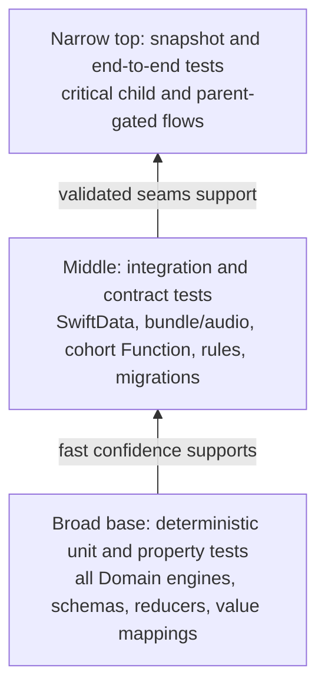

# Testing strategy

This strategy implements ADR-000 D1-D5, D9, and D10 and Cure's requirement for at least 80%
coverage on new code. Pure Domain engines are the center of the plan: they make pedagogical
behavior exhaustively testable in milliseconds without a simulator, SwiftUI lifecycle, audio
device, database, or network. That is how 80% is attainable on this SwiftUI codebase without
mistaking screenshot execution for business-logic coverage.

## Pyramid and coverage policy

Coverage is measured on executable lines added or changed in each pull request, not diluted by
the existing repository. New production code must reach at least 80% line coverage, with no
exclusion for Domain or Data adapters. Generated code, schema files, and declarative assets are
excluded from the denominator but validated by their own gates. Coverage is necessary and not
sufficient: every decision-table branch and every failure path named in
[flows](flows.md) needs an assertion even if line coverage has already passed.

Test ownership follows the architecture:

| Layer | Primary tests | What is real |
| --- | --- | --- |
| Domain | Example, table-driven, property, and golden-file tests | Pure types and engines; explicit clocks/random seeds/policies |
| Data | Repository, decoder, audio-manifest, MetricKit mapping, transport, and migration integration tests | Temporary SwiftData store or emulator; no production project |
| Presentation | TCA reducer tests and focused view snapshots | Test stores, deterministic dependencies, fixed size/content-size category |
| System | Critical-flow UI tests, no-network invariant, static-site route/bundle tests | Simulator plus local files/emulators; network denied except explicit cohort contract suite |

## Mandatory architecture gates

### D1 no-network invariant

The MVP release suite launches a fresh installation, loads bundled content, completes a full
teaching session containing correct, incorrect, narration-skip, background/resume, and clean-exit
paths, then resumes it. With cohort state absent, `FailOnUseTransport` records zero invocations.
A source allowlist proves `CohortUploadClient` is the only socket/API owner, and a linked-binary
audit rejects Firebase, Google Sign-In, analytics, ads, Crashlytics, and other network-capable
third-party SDKs. The test repeats with cohort enabled but no weekly batch due and still expects
zero requests. Any new request fails the release.

The separate cohort contract suite may enable network only to a local emulator and asserts that
the client can call exactly `/v1/cohort/batches`, only for a due weekly batch or revocation.
Redirects, alternate hosts, arbitrary methods, and response-driven URL changes are rejected.

### D3 content validator

CI validates JSON Schema, schema/content/taxonomy versions, closed engine registration, all skill
and audio references, audio checksums and decodability, prerequisite acyclicity, level
reachability, and skill-to-level coverage before compiling iOS. Mutation fixtures deliberately
insert `main-idea` as an engine, remove one audio file, orphan one skill, introduce a prerequisite
cycle, and make one level unreachable; each must fail with the expected stable error code and
JSON pointer. The validator runs again against copied app-bundle resources.

### Golden file for every engine

Each engine owns a versioned JSON fixture corpus of inputs and canonical outputs:

| Engine | Golden cases that must exist |
| --- | --- |
| `TracingEngine` | Empty strokes, accurate trace, single-dot coverage failure, outside scribble, tolerance boundary, and fitted one/two/many-glyph templates |
| `BlendingEngine` | Child-controlled slow/fast motion, ordered completion, reversal, interruption, retry, and independent evidence output |
| `WordBuildingEngine` | One box per phoneme, digraph in one phoneme position, correct/misplaced tile, distractor, reset, and independent completion |
| `PlacementEngine` | No evidence starts easier, ambiguous evidence stays easier, failure moves no harder, and sustained independent success advances quickly |
| `PacingEngine` | New instruction, mastery transition, spaced-review due boundary, failed-item review without lecture, narration skip neutrality, and immediate clean exit |

Golden updates require an educator/domain reviewer and an explanation tied to the content or
policy change. A blanket "record new snapshots" command cannot approve changed pedagogy.

### Tracing canvas snapshots

Snapshot the same guide and hit-test overlay after applying `TracingEngine.fitTransform` at phone
portrait widths and supported tablet/window sizes for one, two, three, and the schema-maximum
twelve glyphs. Include Dynamic Type and right-to-left layout isolation even though glyph content
remains authored English. Each snapshot test also numerically asserts that transformed bounds are
inside the padded canvas, centers coincide within tolerance, and the guide, anchors, and hit-test
path share the identical transform. A two-glyph fixture must reproduce the formerly oversized
approximately 1,236-point path and prove it fits a roughly 350-point canvas.

### WCAG 2.2 token contrast

Run automated contrast assertions over every allowed foreground/background token pairing used by
iOS and web. Text requires 4.5:1 for normal text and 3:1 for large text; non-text essential UI
boundaries require 3:1 where applicable. The shipped amber `#D4860B` measures **2.91:1 on white**,
so it fails even the 3:1 large-text floor and cannot be approved as white-backed text or an
essential standalone indicator. A replacement token or a darker text/background pairing must
pass the assertion; meaning cannot depend on amber alone.

### Local migration round trip

For every SwiftData schema version, build a fixture store containing active and completed
sessions, success/failure/abandonment attempts for each engine, mastery states, and a queued
cohort batch. Export it, migrate it through every intermediate version, reopen it, export again,
and compare normalized records and checksums. Then restore the preflight export into a clean store
and compare again. Inject termination before a batch, after data writes but before checkpoint,
and on an invalid record; rerun must converge, quarantine the invalid item without guessing, and
preserve the old readable store. A failed migration may never produce an empty replacement store.

## Component test matrix

| Component | Unit | Integration/contract | UI/system |
| --- | --- | --- | --- |
| Domain engines | Full decision tables, properties, golden files | None needed for I/O | Exercised through critical teaching flow |
| TCA features | State/action/effect tests, cancellation IDs, failure branches | Compose with temporary repositories | First launch, teaching, exit/resume, parent gates |
| Bundle curriculum | Decoder and semantic validator fixtures | Validate copied bundle and decode every level | Open first, middle, and final reachable activities |
| Recorded audio | ID resolution and cancellation state | File exists, checksum, codec, completion/stop callback | Narration visible skip and immediate interruption |
| SwiftData | Mapping and transaction policy | Temporary-store atomicity, corruption handling, migrations | Kill/relaunch checkpoint recovery |
| Cohort client/Function | Request encoding, redaction, retry policy, Zod branches | Functions/Firestore emulators, idempotency, quota, revocation, deny rules | Parent enable/revoke; offline weekly retry |
| Static web | Content and route manifest | Clean static export and Hosting emulator redirects | Playwright accessibility and five-page navigation |
| Post-MVP record | Auth/ownership/entitlement decisions | Auth/Firestore emulator, StoreKit JWS fixtures, staged migration | Purchase cancel/pending/success and migration rollback |

## Flow acceptance tests

1. **First launch:** Given no store, account, cohort state, or network, launch reaches the first
   item without `Welcome, Parent!`, auth, onboarding, paywall, or request.
2. **Teaching agency:** Every narration phase can be interrupted; skip is neutral evidence; an
   incorrect answer never locks the child into a lecture; exit writes a resumable checkpoint.
3. **Placement:** Early strong evidence advances, ambiguous/failed evidence biases easier, and no
   screen or accessibility label calls the interaction an assessment.
4. **Cohort:** Invalid code, offline, duplicate, quota, server error, success, and revocation paths
   match the single-endpoint contract and never expose submitted values in logs/errors.
5. **Record upgrade:** Cancelled gate/purchase/auth and failed upload all preserve the local
   record; only checksum-verified staging enables sync.

## CI order and evidence

```mermaid
flowchart LR
    Static["Static architecture checks<br/>imports, target graph, network allowlist"]
    Content["Content and audio validator"]
    Unit["Swift and TypeScript unit tests<br/>coverage on changed code at least 80%"]
    Integration["SwiftData and Firebase emulator tests"]
    Visual["Golden, tracing snapshot,<br/>and contrast assertions"]
    Build["iOS build plus Next.js static export"]
    System["No-network and critical-flow tests"]
    Release["Release candidate evidence bundle"]

    Static -->|"pass"| Content
    Content -->|"pass"| Unit
    Unit -->|"pass"| Integration
    Integration -->|"pass"| Visual
    Visual -->|"pass"| Build
    Build -->|"pass"| System
    System -->|"pass"| Release
```

The evidence bundle records tool versions, commit, content/taxonomy versions, coverage report,
validator manifest hash, allowed route manifest, linked dependency manifest, no-network trace,
snapshot diff result, contrast matrix, and migration checksums. Production Firebase and real
family data are never test dependencies. A flaky release gate is fixed or the release remains
blocked; it is not retried until green and waived informally.
