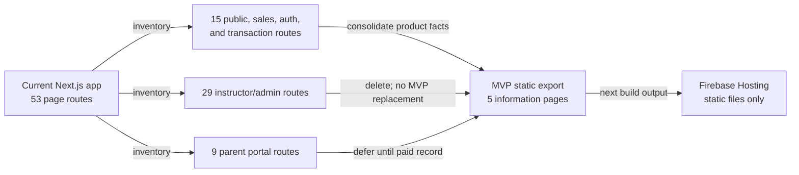

# Web architecture

This document implements ADR-000 D7 and D8. The MVP website is an adult-facing static trust and
support surface. It is not a learner client, parent portal, instructor console, enrollment funnel,
or authentication shell.

## Target: five static pages

| Route | One job | Required content |
| --- | --- | --- |
| `/` | Explain what it is | Phone-native, systematic decoding instruction a child can begin independently; App Store path when available |
| `/who-its-for` | Explain who it is for | Children 8-11 reading below grade level, parent context, and explicit not-a-diagnostic/not-a-school boundaries |
| `/why-free` | Explain why instruction is free | Free full decoding sequence, future paid parent-held record, no ads, and no instruction paywall |
| `/trust` | Show how a parent knows it is safe | No-account/no-network MVP, recorded audio, local data, cohort exception, privacy/terms sections, Kids Category posture, and plain-language controls |
| `/support` | Provide help | Installation and accessibility help, local reset/export guidance, cohort revocation/contact instructions, and static FAQs |

The trust page is a substantive product deliverable. It must let a teacher decide whether to
recommend the app and let a parent decide whether to hand over a phone without interpreting an
SDK list or legal boilerplate. Claims on that page are generated from the same data inventory and
network tests described in [privacy architecture](privacy-architecture.md), and release review
blocks copy that exceeds the tested behavior.

## Current 53-route disposition

This inventory is against the current `app/**/page.tsx` tree. Counts are page routes, with dynamic
segments counted as one route definition.

| Current route group | Count | Disposition and replacement |
| --- | ---: | --- |
| `/` | 1 | Keep the path; replace its sales/program composition with the new "what it is" page. |
| `/about` | 1 | Replace with `/who-its-for`; hosting may issue a static 301. |
| `/contact`, `/faq` | 2 | Consolidate into `/support`; static 301 to the page or matching anchor. No form submission or lead capture. |
| `/privacy`, `/terms` | 2 | Consolidate into substantive `/trust#privacy` and `/trust#terms` sections; static 301 preserves old links. |
| `/program`, `/tutoring`, `/summer-guide` | 3 | Delete sales/service/lead surfaces. Replace product explanation at `/` and pricing rationale at `/why-free`; no checkout or capture replacement. |
| `/enroll`, `/enroll/agreement`, `/success` | 3 | Delete enrollment transaction flow. `/why-free` explains that instruction has no enrollment gate. Return static 410 for transaction callbacks that must not appear successful. |
| `/login`, `/signup` | 2 | Delete with no MVP account substitute under D7. Return static 410, with a link to `/trust` explaining local progress. |
| `/unsubscribe` | 1 | Delete because the MVP captures no email and sends no campaign. Return static 410. |
| `/admin`, `/admin/assessments`, `/admin/assessments/[studentId]`, `/admin/assessments/student`, `/admin/attendance`, `/admin/curriculum`, `/admin/curriculum/assessments/pre`, `/admin/curriculum/assessments/post`, `/admin/curriculum/assessments/probes`, `/admin/curriculum/communications`, `/admin/curriculum/lesson/[date]`, `/admin/curriculum/portfolio`, `/admin/curriculum/scope-and-sequence`, `/admin/curriculum/today`, `/admin/curriculum/week/[weekNumber]`, `/admin/curriculum/week/[weekNumber]/materials`, `/admin/email-log`, `/admin/materials`, `/admin/materials/[weekNumber]`, `/admin/pipeline`, `/admin/probes`, `/admin/probes/week/[weekNumber]`, `/admin/reports`, `/admin/reports/template/alignment`, `/admin/reports/template/final`, `/admin/reports/template/weekly`, `/admin/resources`, `/admin/students`, `/admin/subscribers` | 29 | Delete all instructor operations. There is no MVP replacement; static 404/410 is preferable to a rewrite into the home page. |
| `/portal`, `/portal/agreements`, `/portal/intake`, `/portal/notifications`, `/portal/photo-release`, `/portal/profile`, `/portal/reports`, `/portal/resources`, `/portal/students/[studentId]/sessions` | 9 | Delete all parent-portal routes for the MVP. Parent record/read/export is redesigned in the post-MVP record phase, not preserved as dormant code. |
| **Total** | **53** | **Five static routes remain after consolidation; none is a learner or authenticated surface.** |

The five target routes replace information, not old business behavior. Hosting redirects are
allowed only for stable public information URLs. Admin, auth, enrollment, and portal paths must
not be catch-all rewritten to `index.html`, because a successful shell obscures that the secured
surface was removed.

## Static export implementation

The repository already uses the Next.js App Router with `output: 'export'` and unoptimized images
in `next.config.js`, publishing `out/` through Firebase Hosting. Preserve that shape. Each of the
five pages must be build-time renderable: no `cookies()`, authenticated layout, server action,
route handler, dynamic segment, Firestore query, Function call, runtime environment secret,
analytics script, or client-side data hydration.

Shared presentation is limited to static navigation, footer, accessibility controls, and content
sections. Content can be TypeScript/MDX committed with the site, but the build output must be
complete HTML/CSS/JS assets. Support may use a `mailto:` link or show contact instructions; it
must not submit a form, create a lead, or place a tracking pixel.

`firebase.json` keeps `public: "out"` and `cleanUrls: true`, removes the current dynamic-route
rewrites, and adds only explicit static redirects/410 handling from the inventory above. A clean
deployment artifact must contain no credentials or runtime configuration.

## Delete the behavior with the routes

D8 requires removing the security surface, not merely hiding navigation. The implementation
change must delete or make unreachable all of these old-product dependencies:

| Layer | Required deletion boundary |
| --- | --- |
| Next routes | All 48 page files not implementing the five target routes, all `app/_api-server/**` route handlers, authenticated/admin/portal layouts, and their route-specific loading code |
| Client and server services | `lib/auth-context.tsx`, `lib/firebase.ts`, `lib/firebase-admin.ts`, `lib/functions-config.ts`, `lib/analytics.ts`, Stripe/subscription modules, and admin, assessment, attendance, curriculum, e-signature, iOS-progress, notification, portal-progress, probe, report, resource, student, and subscriber service modules once the route import graph is empty |
| Components | `components/admin/**`, `components/auth/**`, `components/booking/**`, `components/portal/**`, enrollment/checkout/pricing/countdown components, Google Analytics, and old tutoring/program/summer-guide sections not used by the five pages |
| Cloud Functions | Every current export and handler for contact, enroll, Stripe checkout/webhook/customer portal, summer-guide capture/drip, attendance notifications, weekly digest, unsubscribe, email sequences/previews/reminders, photo release, intake reminders, and e-signature. The MVP Functions barrel exports only the new `cohortIngest`. |
| Firestore and Storage | Replace rules for users, students, lessons, sparks, resources, reports, admin tasks, probes, assessments, attendance, notifications, legal documents, enrollment, email, billing, and lead collections with the D6 deny-by-default cohort rules. Remove Storage use or deploy a deny-all Storage ruleset if the project requires the product enabled. |
| Firebase Hosting | Remove catch-all rewrites for portal/admin dynamic segments. Keep static export hosting and explicit public-information redirects only. |
| Dependencies/configuration | Remove browser Firebase/Auth/Stripe/email/analytics dependencies and public environment variables after a clean import scan proves the five-page build has no consumer. Server Admin and Functions packages remain only for `cohortIngest`. |

Deletion order is routes and imports first, then dead components/services, then Functions exports
and sources, then rules/configuration/dependencies. The final scan must find no browser import of
Firebase, auth, Firestore, Stripe, analytics, or old service modules and no route other than the
five-page allowlist.

## Post-MVP web boundary

D8 permits a parent record and export surface after the record phase begins, while the learner
web surface remains deferred until Year 3. That future parent surface is authenticated with Sign
in with Apple/Firebase Auth, reads through the household-scoped Record API, and checks the
server-owned entitlement. It is a new route and threat-model review, not a revival of the current
portal or its collections. The five public pages remain statically exportable and independently
deployable.

## Acceptance gates

- `next build` produces exactly the five page documents and their static assets.
- A route-manifest test compares emitted HTML routes with the five-route allowlist.
- A bundle/import scan finds no Firebase client, auth, Firestore, Stripe, analytics, learner,
  admin, portal, or enrollment code in the static output.
- Hosting emulator tests assert intended public redirects and 404/410 behavior for removed
  sensitive routes; there is no catch-all SPA rewrite.
- Axe/Playwright checks cover WCAG 2.2 AA semantics, keyboard navigation, zoom/reflow, focus, and
  contrast on every page.
- Trust-page claims match the current privacy inventory and the passing D1 no-network test.
