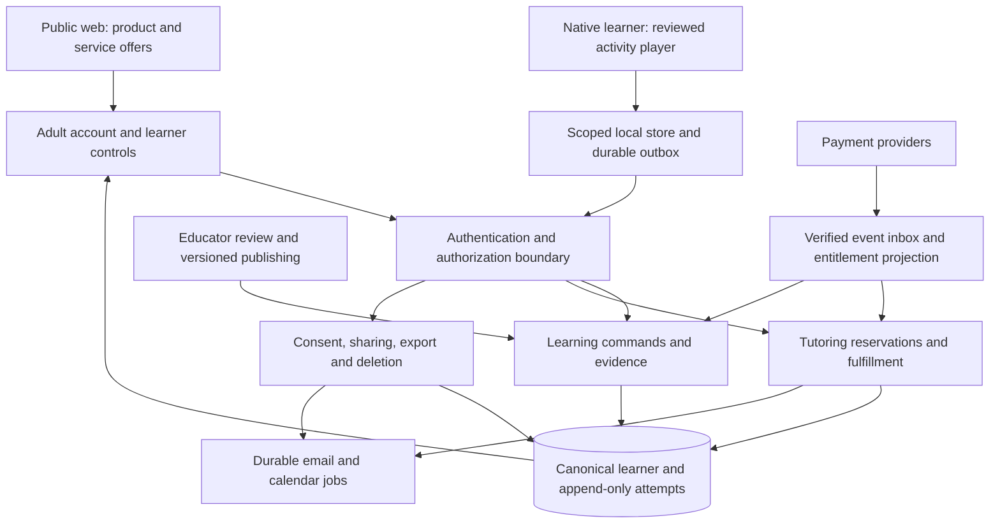

# Proposed architecture and contracts

**RFC status: proposed for review; no migration or implementation has been authorized by this document.** [System map](system-map.md) describes the current system. This proposal supports TASK-LP-014, 020, 025, 042, 048, 050, 051, 054 and 076; individual tickets define acceptance criteria. Names below are illustrative contract names, not a claim these endpoints or collections exist.

## Architectural decision

Retain Next.js for public/adult interfaces, SwiftUI/TCA for the initial native learner experience, Firebase Auth/Firestore/Storage/Functions for the shared backend, and current providers where their delivery contracts can be made reliable. Separate learning, tutoring fulfillment, and payment authority logically before adding services or platforms. A stack replacement would consume effort without establishing the instructional product or resolving ownership rules by itself.

Continue static hosting where suitable. Authenticated screens may use client Firebase SDKs and authenticated endpoints; if a server-rendered requirement is later established, explicitly choose its hosting/runtime and threat model. The existing underscore-prefixed `_api-server` folder is not proof a deployed server route exists. Repair direct-link resolution independently of a hosting redesign.



## Identity and ownership invariants

- Firebase UID identifies an authenticated principal. A learner ID is a separate opaque ID, stable across devices and distinct from an email, name, display order, or the literal `default`.
- An adult/household owns or is explicitly authorized to manage learners. Do not assume every authorized adult has all commercial/admin powers. Multiple guardians, custody/revocation and institutional ownership need explicit decisions before enabling their workflows.
- An enrollment relates a learner to a program/service; purchasing or creating a profile does not automatically create a confirmed enrollment. Program/cohort dates and capacity are versioned configuration.
- The server controls enrollment transitions, booking entitlement consumption, provider mappings and financial entitlement projections. Clients can propose commands but cannot make them true by writing a Firestore field.
- Practitioner authority is a scoped, revocable grant to a learner and purpose. Do not broaden the existing global admin role to every educator.
- Client-facing IDs and document paths are checked against authenticated authority. Body `parentId`, document-stored `id`, email and display name are never ownership proof.
- Cloud collection begins only after the chosen lawful adult/consent flow is satisfied. An authentication account alone does not prove the consent required for a particular child-data purpose.

## Illustrative data boundaries

| Contract / logical store | Key properties | Writer and visibility |
| --- | --- | --- |
| Adult account | UID, preferences, profile schema version | Adult edits allowlisted presentation/preferences; server owns roles, provider mappings and account status |
| Learner | Stable learner ID, ownership reference, minimal profile, schema version | Scoped adult commands; no parent-controlled enrollment authority |
| Consent receipt | Principal, learner, purpose, notice version, verification reference, time, withdrawal | Restricted server workflow; avoid storing unnecessary verification evidence |
| Sharing grant | Learner, principal, exact capabilities, purpose, expiry/revocation | Authorized adult/server; evaluated on each protected operation |
| Service enrollment | Learner, program/cohort version, canonical status, transition history | Server/admin workflow with role checks |
| Activity version | Skill, prerequisite, task schema, stimulus/assets, rubric, reviewer, publication state | Reviewed publishing workflow; immutable published versions and controlled withdrawal |
| Attempt | Stable event ID, learner, activity/rubric versions, response, assistance, timestamps, outcome/provenance | Validated ingestion; raw event immutable except governed deletion/correction process |
| Educator assessment | Instrument/version, observation context, scoring source, recordedAt, supersedes reference | Authorized educator; historical records preserved, notes split by visibility |
| Progress projection | Evidence references, skill/status, derivation version, updatedAt | Server/rebuildable projection; UI labels evidence limitations |
| Reward ledger | Stable reward ID, attempt reference, rule version, amount/reversal | Deterministic adjudication; never substitutes for achievement evidence |
| Reservation | Learner, service entitlement, slot ID, timezone, lifecycle state, version | Transactional server command |
| Payment event inbox | Provider/event ID, payload reference/minimum fields, state, lease, attempts, error class | Verified provider ingestion and restricted workers |
| Entitlement | Account/learner scope, product, provenance, validity, revocation, projection version | Server-only; distinguishes tutoring credits and digital benefits |
| Delivery job | Event, recipient reference, template/version, purpose, stable key, status/retry | Server workers with preference/purpose checks; no arbitrary client recipients |
| Sensitive files | Owner/learner reference, purpose, content metadata, retention class | Authorized upload/finalization and gated delivery; no permanent public capability by default |
| Deletion job | Verified requester, scope, steps, retries, retention exceptions, completion | Restricted server workflow; coordinates all stores/providers |

TASK-LP-014 must choose actual collection paths and migration mappings after evaluating existing nested `users/{uid}/students/{studentId}` data and service-side assumptions. This RFC does not require a wholesale move to top-level learner documents. Keep one canonical ownership source and make query/index design support it; do not indefinitely maintain contradictory copies. Separate private instructor notes into protected records because Firestore document reads do not redact selected fields.

## Learning event and rubric contract

Illustrative shape for contract discussion:

```json
{
  "schemaVersion": 1,
  "eventId": "stable-client-generated-id",
  "learnerId": "opaque-learner-id",
  "activityId": "reading-quest-001",
  "activityVersion": 1,
  "rubricVersion": 1,
  "eventType": "attempt_submitted",
  "response": {"kind": "selected_option", "optionId": "option-b"},
  "assistance": [{"kind": "instruction_replay", "stepId": "step-2"}],
  "clientOccurredAt": "2026-09-05T14:00:00Z",
  "clientSequence": 7
}
```

The server derives principal, consent authorization, receipt time and authoritative validation; it does not trust a supplied account ID or client score. Client timestamps support sequence/context but are not financial or authorization clocks. Bound payload sizes, event kinds, response fields and replay age according to offline requirements. Never include child names, IEP text, payment data or unrelated diagnostics in this event.

Rubric results distinguish submitted/valid/assisted/independent/skipped/abandoned and the actual skill assessed. A supported tracing result may establish practice completion; it does not establish decoding, comprehension or mastery. Help that reads instructions and help that supplies a target passage/answer can have different consequences depending on the construct; the educator defines these distinctions. Store exact rubric/content versions so an answer is interpreted against the task the learner saw.

Fresh independent tasks must be reviewed for content equivalence and not merely replay remembered answers. Persist educator interpretation separately from raw responses. An adult report should show observed task evidence, help and dates with limitations; do not derive a diagnostic label or norm-referenced percentile from an unvalidated app rubric.

## Proposed command/API responsibilities

| Logical command | Authorization and validation | Idempotency / response |
| --- | --- | --- |
| Create/update learner | Adult principal, allowed fields, consent context | Stable request key; canonical learner ID/version |
| Link local/anonymous experience | Proof of source and destination authority; explicit merge policy | Resumable operation ID, source/target mapping, conflicts reported |
| Submit attempt batch | Learner grant, consent, published activity version, bounded payload | Unique principal/learner/event key; accepted/rejected receipt per event |
| Fetch progress | Learner grant and suitable query scope | Version/cursor; distinguishes no evidence, pending sync and error |
| Reserve/cancel/reschedule | Account/learner entitlement, slot state, cutoff/timezone policy | Request key + transaction; canonical reservation/reason |
| Create service checkout | Authenticated principal, server SKU catalog and owned inquiry | Request key bound to principal/offer; provider session reference |
| Accept signed agreement | Owned inquiry, canonical agreement version, valid signature asset | Stable submission key, canonical hash and document metadata |
| Request sensitive file | Owner/admin/scoped role and purpose | Short-lived authorized response; access audit without content logging |
| Grant/revoke practitioner access | Authorized adult and permitted capabilities | Grant version/revocation result; queued writes rechecked |
| Export/delete account or learner | Reauthentication/verification appropriate to operation | Operation ID, progress, retained-data explanation and completion |

Choose callable versus HTTPS per endpoint deliberately; existing conventions can remain where they provide the necessary auth, validation and errors. Specify an error vocabulary such as unauthenticated, forbidden, invalid argument, stale version, capacity conflict, rate limited, consent required and retryable unavailable. Define which operations can safely retry and preserve user input. Avoid exposing existence of other families' records through detailed errors.

## Native persistence and synchronization

The local store is a scoped working copy with durable pending events. The server is the authority for ownership, shared accepted records and commercial state. Use an isolated data actor or documented safe main-actor boundary; return value DTOs across boundaries rather than leaking live SwiftData models into unrelated executors.

Atomically persist an attempt, its provisional display state and the outbox entry locally. Replay under the originating account/learner, with stable keys and bounded retry. A server acknowledgment records accepted/rejected state; losing an acknowledgment must not duplicate progress or Sparks. If server validation reverses a provisional reward, reconcile transparently without rewriting evidence as if it never happened.

On launch/account switch: resolve identity → open appropriate store → hydrate/merge canonical learner state → select authorized learner → enable journey. Never show the previous account's child while new state loads. Offline behavior must explicitly distinguish locally available practice from operations requiring current authority. Revocation, consent withdrawal and deletion invalidate queued cloud writes; do not replay them simply because connectivity returns.

A fresh device restores accepted remote evidence. Unacknowledged local-only data cannot be promised to survive uninstall or device loss. Anonymous/local linking requires proof and conflict review; retaining an anonymous UID string alone is not authorization to import another identity's records.

## Payments and service delivery

Verify provider signatures against configured endpoints and record provider API versions. Atomically claim events with a recoverable processing lease. Mark completion only after required durable state succeeds; retry crashes without duplicate credits. Handle duplicate and out-of-order events using provider state/version reconciliation, not arrival order alone. The old invoice-field cast must be evaluated against actual configured webhook payloads and installed SDK types before selecting a migration.

Reserve a slot and consume the applicable entitlement in a transaction using authoritative state. Cancellation and rescheduling have explicit transition rules and compensation. Separate the reservation's truth from email/calendar delivery; failed notifications become retryable jobs rather than lost state or duplicate reservations. Persist stable provider references and audit only necessary metadata.

Digital access and tutoring fulfillment remain different entitlements. Decide storefront/cross-platform policy before enforcing paid native access. Pending purchase, revocation, expiration, refund and restore each have a tested projection. Do not grant lasting access solely from client flags or assume a tutoring Stripe subscription buys future digital content.

## Content, assets and accessibility

Start with validated versioned content in the repository if it is sufficient for the review workflow. Add an administrative publishing UI only when that workflow needs it. Draft → educator review → published → withdrawn states require provenance and compatibility checks. Published task versions retain their referenced assets/rubrics for reproducible evidence unless privacy or rights obligations require removal.

Package a small offline-safe supported set; define missing-asset and withdrawn-content behavior. Essential icon/audio/design assets are release work, while decorative biome expansion is deferred. Apply shared semantic tokens but preserve native/web interaction conventions. Test reading order, large text, keyboard/switch access where applicable, reduced motion, sound control, non-color cues and motor alternatives with actual screens.

## Environment and operational boundaries

Separate local demo, staging and production projects/configurations and provider credentials. Bundle identity must select the intended environment; test-account scripts must reject production by default. CI verifies web export, functions, rules/indexes/storage, and native build/test/archive inputs appropriate to a change. Promotion records artifact/version/config identity and post-deployment checks.

Inventory actual IAM, service accounts, secrets, regions, Hosting headers, schedules, indexes and provider registrations before asserting production posture. Budget and alert on reads/listeners, writes/retries, blob storage/egress, functions, emails and content operations. Bound lists and batches, use cursor pagination, and measure representative load; do not invent a capacity guarantee.

Restore testing covers Auth/mappings, Firestore, Storage, reviewed content and provider reconciliation, with agreed RPO/RTO and deletion tombstones. Logs use correlation IDs and error classes without child responses or documents. Backups, observability and provider consoles are part of the retention/access model.

## Migration and compatibility order

1. Inventory schemas, counts and ownership anomalies using appropriately authorized access. Record the uncommitted local repair versus deployed state. Never infer historical data is safe from current rules.
2. Approve canonical IDs/contracts and map every old reference. Quarantine ambiguous ownership; do not guess from names or overwrite a sibling's record.
3. Implement resumable jobs with checkpoints, idempotent keys, dry-run reports, access tests and deletion exclusions. Establish backup/restore and signed-download-token treatment before changing sensitive records.
4. Deploy compatible readers and server controls before enabling new writers. If temporary dual read/write is needed, give it a source of truth, reconciliation procedure and removal milestone.
5. Migrate in bounded batches and compare counts, IDs, relationships, access and representative computed results. Preserve original assessment history/provenance.
6. Enable clients progressively with version/feature controls; verify account restore and outbox replay. Old clients that bypass corrected authority must be blocked or restricted safely.
7. Remove legacy paths only after verification and supported-client policy. Recovery preserves privacy fixes and does not restore permissive rules or revoked access.

## Alternatives and unresolved decisions

| Decision | Recommended starting point | Alternative / trigger |
| --- | --- | --- |
| Business boundary | Independent narrow learning offer plus separate tutoring | Practitioner-supported offer if external family evidence shows ongoing educator involvement is essential |
| Learner platform | Finish one native loop; adult web supports it | Browser-first learner slice if actual household/classroom device research establishes stronger reach |
| Backend | Keep Firebase with stricter contracts | Reconsider storage/runtime only against measured query, compliance, cost or transactional requirements |
| Content tools | Versioned reviewed files and publishing validation | Dedicated authoring UI when educator workflow/volume justifies it |
| Collaboration | Owner/admin now; explicit scoped grants when required | Organization tenancy after validated institutional workflows |
| Instructional automation | Deterministic reviewed activities and educator interpretation | AI only as a separately justified, policy-qualified and evaluated proposal |

Product/educator decisions: learner prerequisites, first skill, help semantics, evidence language, content rights and review cadence. Engineering decisions: canonical paths, local actor/store model, idempotency keys, API shape and compatibility window. Business/adviser decisions: offers, consent/retention, storefront policy, institutional agreements and release ownership. Record accepted outcomes as ADRs or approved briefs; this RFC itself makes none of them final.
