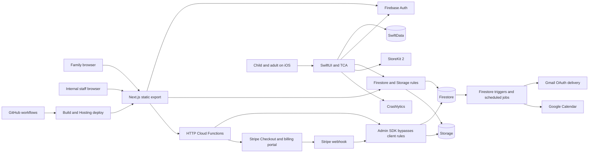

# System boundaries, data flows, and infrastructure coverage

This map describes the inspected repository, including local A01/A02 repairs. It does not assert that every configured function or policy is deployed. [Source hashes and inventory](evidence/source-manifest.json) provide the reproducible source boundary; [findings](findings.md) provide specific evidence.

## Current architecture

The browser talks directly to Firestore/Storage for many operations. Server/Admin SDK code bypasses those rules, so tightening rules does not validate a server handler's inputs. Conversely, valid UI code cannot grant a write denied by rules. Firestore triggers consume records after writes, so client-writable trigger inputs need their own trust boundary.

## Frontend coverage

| Surface | Implemented entry/output | State and integration boundaries | Disposition / tickets |
| --- | --- | --- | --- |
| Public marketing: home, about, program, FAQ, tutoring | Service positioning, prices, links | Static export; expired copy; CTA contracts | Retain brand and service pages, introduce product positioning: 001, 034, 038–040, 066 |
| Contact / summer guide | Anonymous form → HTTP → records/email | Validation and send success; duplicates; lead preferences | Repair operations and segregate product acquisition: 010, 039, 063 |
| Enrollment / agreement / success | Inquiry → account → signature → checkout | Continuation, canonical terms, guest ownership, payment association | Preserve existing service promise; repair: 012, 038, 045, 050, 075 |
| Login/signup/profile | Firebase Auth → user profile → role routing | Token claims now local source of UI role; signup races/recovery incomplete | Retain and harden: 006, 015, 016, 075 |
| Parent intake | Multi-step service data capture | First-child selection, failed-save success, sensitive logs | Repair and keep out of routine digital setup: 014, 036, 064 |
| Parent dashboard / notifications | Program week, reports, native activity, unread ledger | Rule-compatible queries, partial failure, immutable notification content | Rework for digital-only families: 009, 032, 034, 037 |
| Parent student sessions | Native lesson/Sparks history | Static deep links; full-history reads; reward interpretation | Repair and replace with evidence-first view: 023, 032, 035, 061 |
| Parent resources/reports/agreements/photo release | Document lists and download links | Audience, object path, durable URL, consent/retention | Repair access and delivery: 006, 009, 012, 013, 021, 047 |
| Booking/subscription | Slot calendar, session accounting, checkout/portal links | Client/server transaction conflict; auth/SKU wiring | Maintain service reliability: 038, 042–044, 048–053 |
| Admin roster/pipeline/bookings/slots/subscribers | Internal staff operations | Global admin scope; inquiry rules; bulk operations; payment state | Preserve internal tools, do not expose as SaaS staff role: 008, 022, 042–046, 061 |
| Admin curriculum/materials/tasks | Markdown and TypeScript instructor content | Static build-time content; checklist state; no reviewed digital bundle | Reuse editorial material, add versioned publication: 002, 026, 027 |
| Admin attendance/probes/assessments | Staff input → Firestore → parent summaries | Private fields, same-ID history, typed scores, concurrent edits | Repair and version educational evidence: 007, 008, 030, 046 |
| Admin reports/templates/email log | Printed/uploaded reports and operational log | Manual metrics, provenance, access, file storage | Reuse restricted components: 013, 032, 046, 060, 063 |
| Browser child learning | Not implemented | Platform/market decision remains | Research/prototype only until justified: 041 |
| Public `_api-server` source directory and legacy helpers | Retained old route/server implementation | Underscore folder is not a deployed static API; active calls use Functions | Inventory callers, remove/quarantine after verification: 057, 072 |
| CSS and shared controls | Forest/sage brand, buttons, calendar, signature canvas | Accessibility, global layout, typography, errors, animation | Preserve useful tokens; task-level QA: 034, 040, 070, 074 |

A [route inventory](route-inventory.md) lists every current page file. Inventory does not mean every form was exercised against production; principal flows were traced, and runtime evidence is explicitly listed in the audit.

## Native action/effect and lifecycle map

| Entry/action | Reducer/effect | Persistence/external output | Exit and unresolved behavior |
| --- | --- | --- | --- |
| App onAppear → didFinishLaunching | Anonymous/current Auth lookup, fetchProfile, observe StoreKit | Firebase Auth, SwiftData, Crashlytics | Repeated startup/cancellation and failed auth/profile state need explicit handling: 018, 068, 073 |
| Onboarding continueTapped | Constructs name/age/focus; save and sync | Local profile + users/{uid}/students/default; name log | profileSaved emitted after caught failures; no consent gate: 015, 017, 064 |
| Sign-in (email/Apple/Google) | Auth delegate changes UID, fetches students | Replaces session then tries old-UID migration | 0/1/default/picker resolution, no durable migration receipt: 019, 075 |
| Child picker selection/create | Sets journey.studentId, attempts migration | Target student subcollection | Selection in memory; existing profile not hydrated: 017–020 |
| Journey onAppear | Loads static levels | No restored progress or Sparks | Starts index zero; focus not used for validated assignment: 018, 031 |
| Node → preview → start | Root routes by literacy/math category | Catalog token into tracing/cubes | Title/validator mismatch: 024, 028 |
| Literacy Done | Root pops and emits missionComplete | Fixed score/completed lesson and reward | Blank/assisted outcomes conflated: 023 |
| Math check | Local total-count validation then completion | Same lesson/reward writes | Unsupported nil-target and grouping semantics: 024 |
| missionComplete | Optimistic index/Sparks increment; separate local/remote effects | SwiftData + Firestore lesson/Sparks | No atomic outbox or ack state; attribution race risk: 020, 025 |
| Three rewards → paywall | StoreKit product/purchase/restore | Verified transactions → Boolean premium | Dismissible, no lesson enforcement; adult gate absent: 016, 051, 052 |
| SafeSpace onAppear/pet/volume/exit | Mood and ambient audio actions | AVAudioPlayer | Missing referenced asset; navigation/audio cleanup needs tests: 070, 074 |
| Settings sign-out | Clears Firebase session and starts anon again | Auth + diagnostics | Local/visible history remains; export/delete absent: 017, 021 |

`SpeechClient` synthesizes speech; it does not recognize speech or assess oral reading. The safe-space pet is not an implemented decorating/economy system. No Android app, APNs/FCM delivery implementation, SIS/SSO integration, student-facing LLM, RAG service, or validated adaptive engine was found in the inventoried runtime paths. These are absent capabilities, not failing implementations. They are deliberately not all added to the pilot scope.

## Backend operation inventory

All 24 declared exported handlers below are accounted for. Functions source contains 31 TypeScript files including helpers, templates, and PDF code. `index.ts` is the export barrel; local TypeScript compilation passed. Real deployment and provider credentials remain unverified.

| Handler | Trigger / authority | Main dependencies and outputs | Required work |
| --- | --- | --- | --- |
| contact | POST, anonymous | Validation → Gmail/log → contactSubmissions | 010, 063; capture-before-send and bounded input |
| enroll | POST, anonymous | Validation → Gmail/log → enrollmentInquiries | 010, 045, 063; verified claim and durable capture |
| summerGuideCapture | POST, anonymous | guideLeads → guide email | 010, 063; duplicate/consent/delivery state |
| stripeCheckout | GET/POST, anonymous | Cohort SKU → Stripe JSON URL | 038, 050; account/enrollment association, supported SKUs |
| subscriptionCheckout | GET/POST, bearer token | Customer lookup → subscription Checkout | 038, 050; trusted mapping/idempotency |
| customerPortal | GET/POST, bearer token | users customer mapping → Stripe portal | 006, 050, 053; historical mapping verification |
| stripeWebhook | POST, Stripe signature | Claim → billing state → email | 048, 049, 053; retries/order/API versions |
| submitEnrollmentAgreement | POST, bearer token | Client terms → PDF/image → audit → email | 012; canonical terms, inquiry ownership, atomicity |
| getSignedAgreementPdf | GET, bearer owner/admin | Agreement metadata → expiring signed URL | 006, 013; endpoint tests and token review |
| submitPhotoRelease | POST, bearer token | Canonical text hash → files/audit → email URL | 015, 021, 047; scope/withdrawal/history and file lifecycle |
| unsubscribe | GET, signed token | users preference mutation | 063; lead/user suppression coverage and classification |
| previewEmail | HTTP, shared administrative preview token | Reads account/child, renders and optionally sends | 058, 063; production exposure/secret/safe-recipient review |
| previewRampEmail | HTTP, shared administrative preview token | Same for ramp templates | 058, 063; consolidate access and preview behavior |
| onBookingCreated | Firestore create | Record recipient → email + calendar | 042, 044; trusted inputs and outbox |
| onBookingUpdated | Firestore update | Cancellation → email + calendar delete | 043, 044; idempotent transition |
| onAttendanceFlagged | Firestore write | Flags → email + parent notifications | 007, 009, 063; private-field isolation and delivery ledger |
| sendBookingReminders | Daily 08:00 America/New_York | Tomorrow bookings → reminders | 043, 044, 063; timezone and duplicate safety |
| summerGuideDrip | Daily 09:00 America/New_York | Active leads → day-2/day-5 messages | 063; no false sent advancement |
| sendWeeklyDigest | Friday 17:00 America/New_York | Users/students/attendance/reports → digest | 007, 046, 061, 063, 066 |
| sendPreProgramRamp | Daily 09:00 America/New_York | Cohort thresholds → messages | 063, 066; archive/activation control |
| sendWelcomeSequence | Daily 09:00 America/New_York | Enrollment age → day-0/2/7 sequence | 045, 063, 066 |
| sendBalanceDueReminders | Daily 09:00 America/New_York | Payment/program thresholds → reminders | 049, 053, 063, 066 |
| sendPhotoReleaseReminder | Daily 09:00 America/New_York | Release status/program date → reminder | 015, 047, 063, 066 |
| sendIntakeIncompleteReminder | Daily 09:00 America/New_York | Child intake flags → reminder | 036, 063, 066 |

Schedules describe repository values. A scheduler comment saying UTC does not override its configured America/New_York timezone. Outbound provider APIs were not invoked for the audit.

## Data and authorization inventory

| Store / path | Current writer / reader | Trust and migration focus |
| --- | --- | --- |
| users/{uid} | Web profile + Admin billing/lifecycle; owner/admin read | Local allowlist repair; historical random-ID payment docs; canonical identity and billing mapping |
| users/{uid}/students/{studentId} | Parent web/iOS + staff; owner/admin | Parent-writable enrollment/identity; default IDs; service-sensitive fields vs minimal digital profile |
| .../lessons/{id} | iOS/owner; owner/admin | Arbitrary practice telemetry, fixed score, no versioned rubric; append-only event contract needed |
| .../sparks/{id} | iOS/owner; owner/admin | Unverified reward ledger; separate from learning and use stable idempotency |
| .../legalDocs/{docId} | Server; owner/admin | Photo-release state; document scope/history/revocation and retention |
| availableSlots/{id} | Admin writes; authenticated reads | Reservation authority, server timestamps, staff time constraints, avoid exposing unnecessary bookedBy data |
| bookings/{id} | Parent create/update + admin | Forged status/recipient/owner; server transaction and outbox needed |
| enrollmentInquiries/{id} | Server create; staff UI attempts read/write | No rule coverage; verified guest claiming and canonical transitions |
| contactSubmissions/{id} | Server-only | Retention, suppression, operational access; lack of client access is not itself a bug |
| guideLeads/{id} | Server-only | Duplicate leads, consent/unsubscribe, delivery phases, retention |
| resources/{id} | Admin write; all-authenticated read | Enrolled audience not enforced; client counter denied; file URL lifecycle |
| progressReports/{id} | Admin write; owner/admin read | Queries must constrain ownership; document provenance/history and file path repair |
| attendance/{id} | Admin write; owner/admin read | Private notes leak; canonical learner/cohort identity and concurrent edits |
| probeResults/{id} | Admin write; owner/admin read | Private notes, timestamp decoding, per-week overwrite/history |
| assessmentResults/{id} | Admin write; owner/admin read | Instrument/administration provenance, score bounds, pre/post ID reuse, notes classification |
| probes/{id} | Rules exist; active portal reader uses probeResults | Legacy surface: confirm external writers/deployed usage before removing; comments are stale |
| portfolioArtifacts/{id} | Admin write per rules; owner/admin read | Claimed consent-gated writer not established; publishing scope/access/revocation |
| notifications/{id} | Server creates; parent updates selected fields | Existing allow condition permits extra fields/content edits; immutable projection needed |
| emailLog/{id} | Server append; admin read | Recipients/subjects/error metadata are sensitive; retention/access and truthful delivery state |
| adminTasks/{id} | Admin read/write | Preserve staff checklist; tenant scope if later exposed to practitioners |
| webhookEventLog/{id} | Server-only | Claim is not completion; durable state and replay permissions |
| enrollmentAgreements/{id} | Server; owner/admin read | Canonical terms, signer/inquiry relationship, immutable artifact lifecycle |
| SwiftData profile/progress/Sparks | Native local adapters | Actor isolation, identity-scoped schema, migration, outbox, deletion |
| Browser state / caches / analytics | React/Firebase/browser SDKs | Account switching, sensitive draft protection, script-context segregation |
| Stripe / StoreKit | External authoritative providers | Distinct offers; mappings, verification, refunds, restore, reconciliation |

Firestore indexes list 21 composites and no field overrides in the current file. The index file is evidence of intended configuration, not deployed index readiness; query shape/ordering and staging verification are explicitly ticketed. Future collection names in tickets are proposals requiring RFC review.

## Storage and asset inventory

| Path / asset | Current behavior | Required contract |
| --- | --- | --- |
| ieps/{uid}/... | Rule permits owner PDF writes under 10 MB | Make profile uploader use this or a reviewed replacement; validate file content/delivery |
| iep-documents/{uid}/... | Profile uploader uses unmatched path | Migrate/repair, do not broadly open Storage |
| reports/{segment}/... | Uploader uses studentId; rules expect uid | Align metadata/object ownership; review durable URLs |
| resources/... | Authenticated reads, admin writes under 25 MB | Enforce audience and publication rights |
| legal-signatures/{uid}/... | Server writes, owner/admin reads | Versioned consent history, short-lived delivery, revocation/retention |
| signedAgreements/{enrollmentId}.pdf | Direct clients denied by local repair | Server endpoint owner/admin check, historical token investigation |
| signatures/{uid}/... | Owner/admin read, server write | Minimize access to raw signatures; audit retention and safe rendering |
| Bundled native art/audio/fonts/icon | Three raster scene/texture assets; no referenced ambient file; no icon filename | Required assets/rights and fallback validation before distribution |
| Firestore backup bucket | Scripted daily/monthly exports | Freshness and restore evidence; retention/cost/access/deletion review |

## Infrastructure and external dependency coverage

| Layer | Repository evidence | Unknown / focus |
| --- | --- | --- |
| Web runtime | Next 14 static export, React, Tailwind, Firebase SDK | Supported-version remediation, static routing, generated headers/metadata, bundle performance |
| Functions runtime | Node 22 declaration, TypeScript, Firebase Admin/Functions, Stripe, Google APIs, pdf-lib | Runtime-version testing, deployed settings and side-effect recovery |
| Native runtime | iOS 17+, SwiftUI/TCA, SwiftData, SpriteKit/CoreText, StoreKit, Firebase/GoogleSignIn | Real-device lifecycle/accessibility; no Android implementation |
| Hosting/DNS/TLS | Firebase Hosting config and custom-domain references | Effective headers, DNS/TLS/custom domain, cache behavior, legitimate 404s |
| Identity/IAM | Firebase Auth, custom admin claims, service-account scripts | Actual provider configuration, secret binding, minimal roles, session revocation |
| CI/CD | Four workflow files, XcodeGen, Fastlane, lockfiles | Full-surface release dependency, safe E2E, archive reproducibility, deploy permissions |
| Monitoring | Crashlytics wrapper and console/email logs | Privacy-safe alerting, operational owners, support references, SLO evidence |
| Cost/performance | Query code and a backup estimate | Actual workload measurements, budgets, bounded jobs, media growth |
| Backup/recovery | Export/setup/verify/restore scripts and runbooks | Auth/files/config recovery, deletion manifests, restore exercises |
| Data privacy | Policy/manifest/manual deletion docs | Consent implementation, purpose limitation, retention enforcement, SDK traffic |
| Vendor dependencies | Firebase/GCP, Stripe, Apple, Google OAuth/Gmail/Calendar, GA, package registries | Contract/subprocessor inventory and per-environment configuration |
| AI infrastructure | No active LLM/RAG or speech-recognition service in reviewed learning paths | Deferred; future educator-assist experimentation requires separate safety/cost/evaluation review |

## Proposed target boundaries for review

Retain the existing stack initially. Organize it into four logical areas without introducing microservices by default: (1) identity/consent/access, (2) reviewed content and learning events, (3) derived adult evidence/practitioner sharing, and (4) distinct tutoring/billing operations. Use a scoped local store plus durable outbox, immutable versioned content, server-authoritative sensitive operations, and evidence projections that can be regenerated from valid source events.

The first complete product slice is: adult setup/consent → authorized learner selection → reviewed reading quest with explicit help → durable scoped attempt → fresh independent check → adult evidence view → support/export/withdrawal. A web child renderer, broad math curriculum, organizations at district scale, and school operations are subsequent decisions, not prerequisites for learning whether that slice is valuable.
